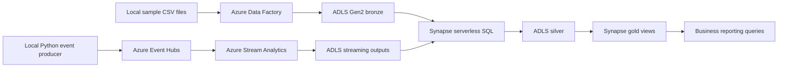
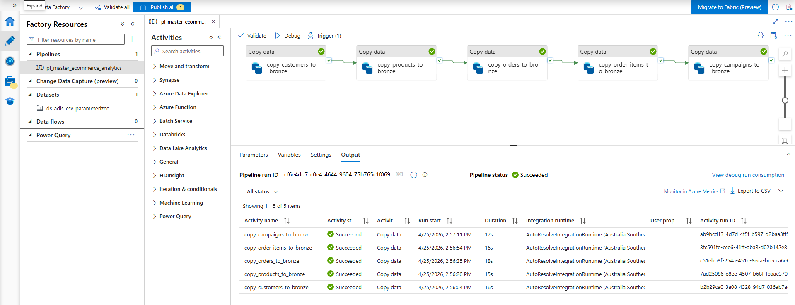
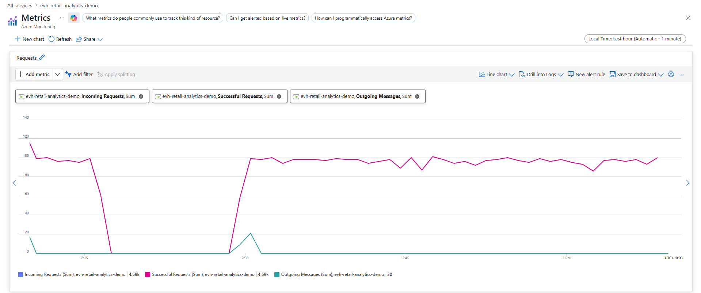
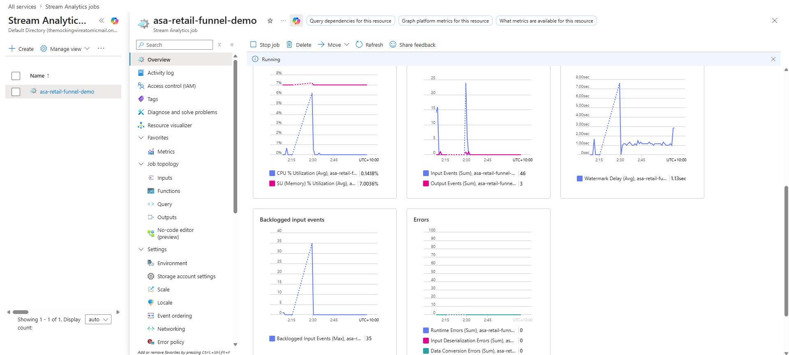
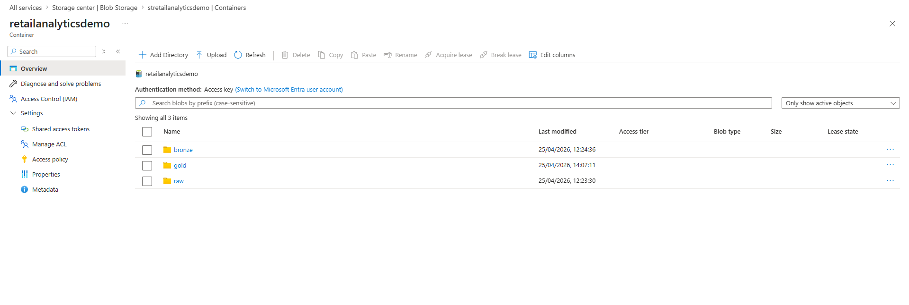
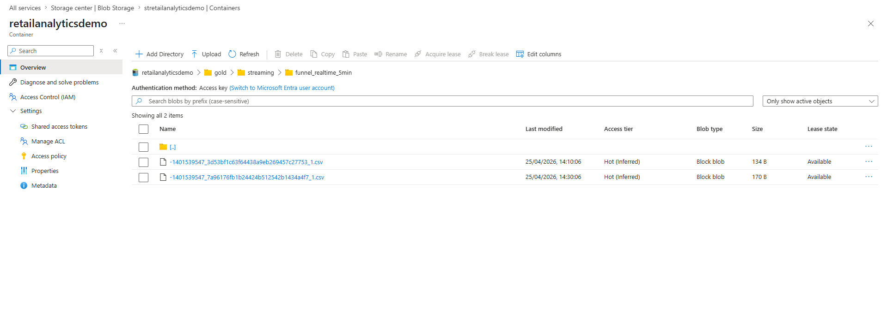
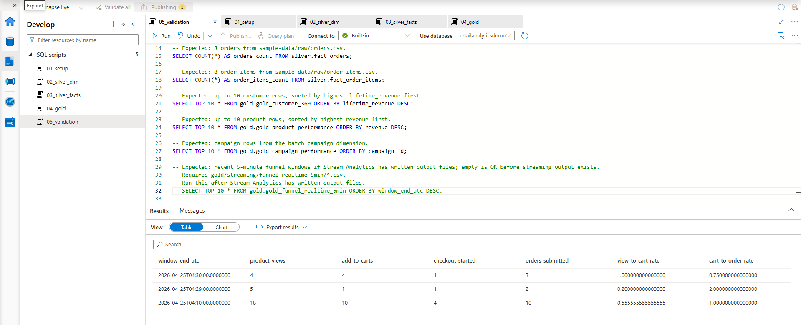
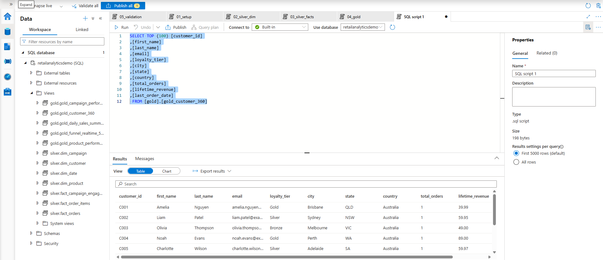

# azure-retail-analytics-hybrid

An Azure-native retail analytics project that combines batch ingestion and near real-time event processing for an e-commerce business. The solution uses Azure Data Factory for file ingestion, Azure Event Hubs for streaming, Azure Stream Analytics for real-time aggregation, Azure Data Lake Storage Gen2 for storage, and Azure Synapse Analytics for SQL-based modelling and reporting.

## Project Overview

This repository models a mid-sized online retailer that wants one analytics platform for operational reporting and customer behaviour analysis. The design is scoped for a reproducible Azure implementation using synthetic data.

The platform supports:

- Batch ingestion of CRM and commerce CSV files
- Streaming ingestion of customer interaction events
- Medallion storage design using `bronze`, `silver`, and `gold`
- SQL transformation with Synapse serverless SQL
- Near real-time funnel reporting
- Customer 360 style analytics

## Business Problem

The retailer has customer, product, order, and campaign data arriving in files, while web and email interactions happen continuously. Leadership wants:

- Daily sales and margin reporting
- Product performance by category
- Customer 360 insights across purchases and engagement
- Campaign effectiveness reporting
- Near real-time funnel visibility for browsing through to order submission

Without a unified platform, file-based reporting is delayed and streaming events remain disconnected from customer and order history.

## Architecture



## Service Roles

- `Azure Data Factory`: Ingests batch source files into the lake and standardises landing patterns
- `ADLS Gen2`: Stores `bronze`, `silver`, `gold`, and streaming outputs
- `Azure Event Hubs`: Receives simulated customer interaction events
- `Azure Stream Analytics`: Creates X-minute windowed funnel metrics
- `Azure Synapse Analytics`: Uses serverless SQL for transformation, modelling, validation, and downstream reporting
- `Synapse pipelines`: Orchestrates SQL model execution after raw data lands
- `Local Python`: Simulates customer activity without requiring a separate Azure application host

## Service Role Justification

- `ADF` is used for file ingestion and scheduling.
- `Synapse serverless SQL` keeps transformation costs low and stays close to standard analytics SQL patterns.
- `Synapse pipelines` are included to show orchestration inside the analytics workspace without replacing ADF ingestion.
- `Event Hubs` provides an Azure-native streaming entry point.
- `Stream Analytics` provides managed windowed metrics without custom stream-processing code in Azure.
- `ADLS Gen2` anchors the medallion storage design.
- `Local Python` generates streaming events without deploying an application host.

## Batch and Streaming Design

Customer, product, order, and campaign files are stable business datasets suited to scheduled ingestion and SQL transformation. Customer interactions such as product views and cart actions are high-frequency behavioural signals that are more useful when monitored close to real time.

Retail analytics works best when historical transactions and current funnel behaviour are visible together. This project shows both without adding unnecessary platform complexity.

### Batch path

1. Source CSV files are stored locally and uploaded or copied into the raw landing zone.
2. ADF pipelines ingest them into `bronze`.
3. Synapse SQL transforms them into curated `silver` dimensions and facts.
4. Gold reporting models are exposed through Synapse serverless views.

The project uses a scheduled batch refresh for customer, product, order, and campaign files. In production, this could be replaced or supplemented with storage-event triggers through Event Grid so new file arrivals start the ADF pipeline automatically.

### Streaming path

1. Local Python emits JSON events to Event Hubs.
2. Stream Analytics reads those events and performs 5-minute tumbling window aggregations.
3. Aggregated outputs land in ADLS.
4. Synapse queries expose the aggregated funnel output alongside batch reporting models.

## Medallion Design

- `bronze`: Raw CSV and event outputs with minimal transformation
- `silver`: Cleaned relational dimensions and facts with standardised types and business keys
- `gold`: Business-facing models such as customer 360, daily sales, campaign performance, and real-time funnel summaries

## Data Model

Silver dimensions:

- `dim_customer`
- `dim_product`
- `dim_campaign`
- `dim_date`

Silver facts:

- `fact_orders`
- `fact_order_items`
- `fact_campaign_engagement`

Gold views:

- `gold_customer_360`
- `gold_daily_sales_summary`
- `gold_product_performance`
- `gold_campaign_performance`
- `gold_funnel_realtime_5min`

Modelling notes:

- Customer 360 combines customer profile and submitted order history.
- Product performance derives margin using product cost and sold quantity.
- Funnel output is generated upstream in Stream Analytics, then surfaced in Synapse.

## Key Outputs

- `gold_customer_360`
- `gold_daily_sales_summary`
- `gold_product_performance`
- `gold_campaign_performance`
- `gold_funnel_realtime_5min`

## Repository Structure

```text
azure-retail-analytics-hybrid/
|-- README.md
|-- datafactory/
|-- docs/
|-- sample-data/
|-- stream-analytics/
|-- streaming/
`-- synapse/
```

## Setup Summary

1. Follow the build order in `docs/01-build-order.md`.
2. Provision Azure resources from `docs/03-azure-portal-tasks.md`.
3. Configure each service using its dedicated task file.
4. Run the workflow sequence from `docs/08-demo-runbook.md`.

Detailed steps are in [docs/01-build-order.md](./docs/01-build-order.md).

## Run Sequence

1. Run batch ingestion for all five CSV sources.
2. Execute Synapse SQL transformations and gold models.
3. Start the Stream Analytics job.
4. Run the Python producer.
5. Query funnel, sales, campaign, and customer outputs.

The full run sequence is in [docs/08-demo-runbook.md](./docs/08-demo-runbook.md).

## Cost Control Notes

- Prefer Synapse serverless over dedicated pools
- Keep Event Hubs throughput small for this workload
- Run Stream Analytics only while testing or processing events
- Delete or stop short-lived resources after screenshots
- Avoid large historical replays unless needed for a specific validation run

See [docs/09-cost-control-notes.md](./docs/09-cost-control-notes.md).

## Manual vs Repo-Provided Work

- `Manual in Azure portal`: Resource creation, linked services, managed identities, Event Hubs, Stream Analytics job wiring
- `In service UI`: ADF pipelines, Synapse pipelines, SQL script execution, Stream Analytics query deployment
- `Provided in repo`: SQL, Python event generators, example pipeline definitions, sample data, documentation, naming conventions
- `Could be automated later`: Bicep/Terraform, CI/CD, automated deployment of pipelines and SQL assets

## Screenshots














