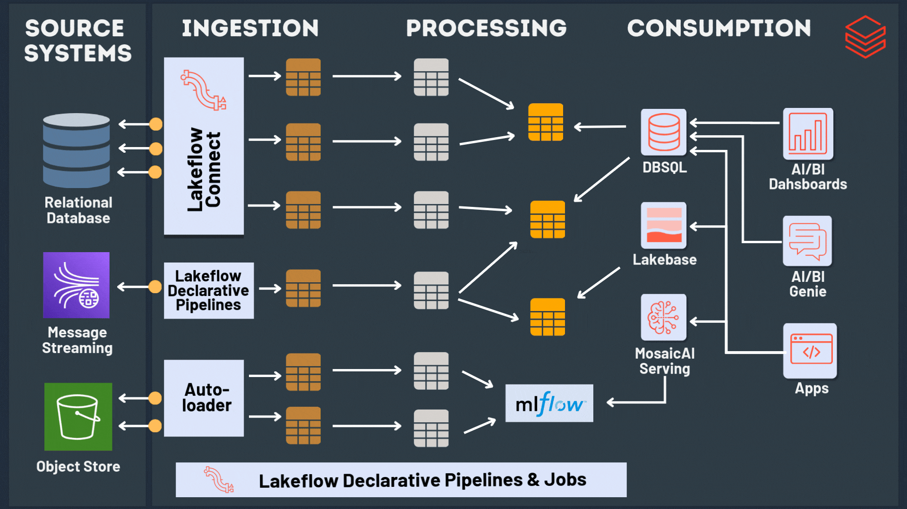

# Automated Insurance Claims on Databricks

This project is a Spark-first Databricks demo for an automated insurance claims workflow. It combines telematics, CSV source data, claim images, and medallion-style transformations into a simple three-step pipeline that is easy to run and explain.



## What This Project Covers

- File-backed telematics stream that mimics Kinesis for demo use
- CSV ingestion for policy, claim, and customer source data
- Image ingestion for claim and training images
- Bronze, silver, and gold data transformations with plain Spark

## Repository Layout

- `pipelines/`: the three main Databricks pipeline scripts
- `tools/`: helper scripts for base uploads and live demo source generation
- `code/csv_input_reference`: legacy reference assets kept for sample context
- `data/`: sample source data used by the demo

## Pipeline Steps

1. `pipelines/01_bronze_ingestion.py`
2. `pipelines/02_silver_transforms.py`
3. `pipelines/03_gold_transforms.py`

The scripts are intentionally small and readable:

- `01_bronze_ingestion.py` ingests landed files into Delta bronze tables.
- `02_silver_transforms.py` cleans and standardizes records.
- `03_gold_transforms.py` builds aggregated and joined business tables.

Demo architecture note:

This repository keeps the DLT bronze path front and center because the goal is
to demonstrate Spark and Lakeflow / DLT skills in one sample project. The
bronze configuration also includes an `auto_claims.bronze.use_dlt` switch to
make the tradeoff explicit. That switch exists because this is a demo
environment with practical limits: only one pipeline can be run at a time, and
continuous bronze execution is not always available or reliable enough to show
Auto Loader archive behavior consistently. In a real implementation, one bronze
ingestion path would be chosen and fully implemented rather than carrying both
options in the same project.

Current demo default:

- `auto_claims.bronze.use_dlt=true` keeps bronze ingestion inside Lakeflow / DLT.
- `auto_claims.bronze.use_dlt=false` runs the alternate non-DLT bronze path in
  `pipelines/01_bronze_ingestion.py`, which loads the current landing files as a
  regular Spark job and archives the processed source files manually.
- The current bundle configuration is set to `auto_claims.bronze.use_dlt: "false"`
  in `resources/pipelines.yml` so the non-DLT path can be tested directly.

## Kinesis Replacement

There is no live Kinesis dependency anymore.

Instead, bronze telematics ingestion watches a landing folder:

- `/Volumes/<catalog>/<landing_schema>/<landing_volume>/telematics`

Drop new parquet files there and Auto Loader will treat them as arriving events. This gives you a practical stand-in for a streaming source while keeping the rest of the pipeline logic intact.

The operational source tables are handled as CSV files for demo purposes:

- `/Volumes/<catalog>/<landing_schema>/<landing_volume>/csv_inputs/policies`
- `/Volumes/<catalog>/<landing_schema>/<landing_volume>/csv_inputs/claims`
- `/Volumes/<catalog>/<landing_schema>/<landing_volume>/csv_inputs/customers`

Drop CSV snapshots into those folders and bronze ingestion will create the source tables used by the silver and gold steps.

For demo data operations:

- [demo_upload_source_data.py](./tools/demo_upload_source_data.py) resets the landing volume and uploads the current sample files as the base dataset
- [demo_stream_source_data.py](./tools/demo_stream_source_data.py) lands flat-file live batches every 30 seconds, including two claim images per sampled claim and matching metadata rows

## Databricks Configuration

The project reads the main settings from Spark conf or environment variables:

- `auto_claims.catalog`
- `auto_claims.bronze.use_dlt`
- `auto_claims.schemas.landing`
- `auto_claims.volumes.landing`
- `auto_claims.schemas.bronze`
- `auto_claims.schemas.silver`
- `auto_claims.schemas.gold`

Default values point to the sample `training_0003_auto_claims` catalog and a managed landing volume named `landing`.

Bundle path note:

Databricks Asset Bundles expose `${workspace.file_path}` inside `resources/job.yml`. It expands to the workspace folder where the bundle files were uploaded for the active target, for example:

`/Workspace/Users/<user>/.bundle/auto-claims/dev/files`

That is why the job tasks reference files like `${workspace.file_path}/tools/demo_upload_source_data.py`.

Before deploying the Databricks pipelines, create the catalog manually once:

```sql
CREATE CATALOG IF NOT EXISTS training_0003_auto_claims;
```

The project code will create the required schemas and landing volume automatically inside that catalog at runtime.

Bundled jobs:

- `training_0003_auto_claims_01_upload_base_data` clears the landing volume and uploads the base source files.
- `training_0003_auto_claims_02_run_pipelines` runs bronze, then silver, then gold.
- `training_0003_auto_claims_03_live_demo_feed` continuously lands synthetic source updates for demo purposes.

## Local Environment

Use [environment.yml](./environment.yml) to create a local conda environment for Databricks development.

Example:

```bash
conda env create -f environment.yml
conda activate auto-claims-databricks
```

The included `databricks-connect` version is a starter default. If your Databricks Runtime uses a different compatible version, update `environment.yml` so the local client matches your workspace target.

## Run From VS Code

Recommended workflow for this project in VS Code:

1. Create and activate the conda environment.
2. Open this repo folder in VS Code.
3. Select the `auto-claims-databricks` Python interpreter in VS Code.
4. Install the Databricks VS Code extension.
5. Sign in to your Databricks workspace from the Databricks sidebar.
6. Attach Databricks Connect to a compatible cluster or serverless compute.
7. Run the repo scripts in order:
   `tools/demo_upload_source_data.py`
   `pipelines/01_bronze_ingestion.py`
   `pipelines/02_silver_transforms.py`
   `pipelines/03_gold_transforms.py`

If you want live source updates after the base load, run:

`tools/demo_stream_source_data.py`

Databricks local setup note:

- The Databricks VS Code extension and Databricks Connect expect local workspace
  configuration to be set up before Databricks-backed code can run from VS Code.
- In practice, that usually means signing in through the VS Code extension and
  having the local `.databricks/` state created on your machine for profiles,
  workspace details, and related connection metadata.
- This repo ignores `.databricks/` in Git because it is local machine state, not
  project source code, and it can contain user-specific connection details.
- If that local Databricks setup has not been completed yet, the Python files in
  this repo can still be opened locally, but Databricks jobs, pipeline runs, and
  Databricks Connect-backed Spark execution from VS Code will not work.

How it works:

- Your regular Python code runs in VS Code on your local machine.
- Spark DataFrame operations run on Databricks compute through Databricks Connect.
- If you want to submit a file directly to Databricks from VS Code, use the Databricks extension's run commands.

Practical note:

- This repo is written as plain Python scripts, so the easiest path is to open a script in VS Code and run/debug it with the Databricks extension plus Databricks Connect configured.
- Some Databricks-specific features are still limited in Databricks Connect, so if a script depends on unsupported features, run it as a Databricks job instead.

Official Databricks references:

- VS Code extension overview: https://docs.databricks.com/gcp/en/dev-tools/vscode-ext
- Install and configure the VS Code extension: https://docs.databricks.com/aws/en/dev-tools/vscode-ext/install
- Run files from VS Code on Databricks: https://docs.databricks.com/en/dev-tools/vscode-ext/run.html
- Databricks Connect for Python: https://docs.databricks.com/dev-tools/databricks-connect.html
- Databricks Connect examples: https://docs.databricks.com/aws/en/dev-tools/databricks-connect/python/examples
- Databricks Connect limitations: https://docs.databricks.com/gcp/en/dev-tools/databricks-connect/python/limitations

## Notes

This remains a sample-work project, but the Python code is now organized like a small production Spark project instead of a DLT example. The gold layer is also deterministic now; the old external geocoding placeholder was removed because it was not suitable for a reliable demo or deployment.
