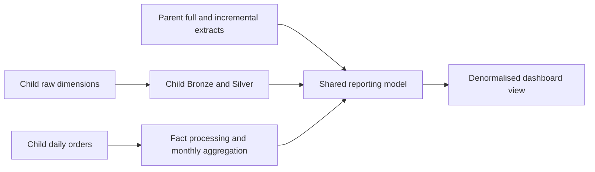

# Databricks Lakehouse Data Engineering Pipeline (Retail, Two Companies)

## Overview

This project demonstrates a Databricks lakehouse integration scenario in which a child retail business is aligned to an existing parent-company reporting model. The pipeline uses PySpark, Spark SQL, Delta Lake, Unity Catalog, and Databricks SQL to ingest child-company source files, standardise dimensions, process facts, and publish a dashboard-ready serving layer.

## Demo Context

This repository contains portfolio data and notebook logic that represent a realistic multi-entity retail integration workflow. It is intended to showcase architecture, harmonisation logic, and incremental processing patterns without relying on proprietary enterprise datasets.

## What The Project Does



- Assumes a parent-company lakehouse model already exists
- Ingests child-company customer, product, pricing, and order data
- Standardises child data to the parent model and shared business keys
- Rebuilds or incrementally recalculates affected fact periods
- Publishes conformed Gold tables and a reporting-friendly view

## Repository Structure

```text
0_data/
  1_parent_company/
    full_load/
    incremental_load/
  2_child_company/
    full_load/
      customers/
      gross_price/
      orders/landing/
      products/
    incremental_load/
      orders/
1_setup/
  dim_date_table_creation.ipynb
  setup_catalog.ipynb
  utilities.ipynb
2_dimension_data_processing/
  1_customers_data_processing.ipynb
  2_products_data_processing.ipynb
  3_pricing_data_processing.ipynb
3_fact_data_processing/
  1_full_load_fact.ipynb
  2_incremental_load_fact.ipynb
  3_import_parent_incremental_data.dbquery.ipynb
4_dashboarding/
  1_large_denormalized_view.dbquery.ipynb
scripts/
  project_inventory.py
README.md
```

## Workflow

1. `1_setup/` prepares the catalog, schemas, utilities, and date dimension.
2. `2_dimension_data_processing/` ingests and standardises child-company dimensions.
3. `3_fact_data_processing/` loads full and incremental order data and aligns it to the target reporting grain.
4. `4_dashboarding/` produces a large denormalised view for BI tooling.

## Data Assets

- `0_data/1_parent_company/` contains parent full-load and incremental extracts used as integration targets.
- `0_data/2_child_company/full_load/` contains the child company master data and landed historical orders.
- `0_data/2_child_company/incremental_load/orders/` contains additional order drops for the incremental fact process.

## Screenshots

### Workspace


### Catalog


### Pipeline


## Notes

- The main implementation emphasis is the child-company side of the integration.
- The project is useful for reviewing conformance, entity harmonisation, and incremental recomputation patterns in Databricks.
