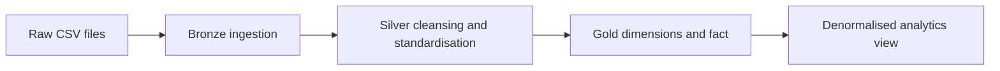

# Databricks Lakehouse Data Engineering Pipeline (e-Commerce)

## Overview

This project demonstrates a batch-oriented e-commerce lakehouse pipeline built in Databricks using Unity Catalog, Delta Lake, PySpark, and the medallion architecture. Raw CSV extracts are ingested into Bronze tables, standardised in Silver, and reshaped into Gold dimension and fact tables for downstream analytics and dashboarding.

## Demo Context

The data bundled with this project is synthetic portfolio data designed to represent an e-commerce reporting pipeline. It is included so the notebook flow, table design, and transformation logic can be reviewed end to end without exposing proprietary source systems.

## What The Project Does



- Creates a dedicated Databricks catalog and schemas for Bronze, Silver, Gold, and reference data
- Loads raw product, category, brand, customer, calendar, and order-item files into Delta tables
- Applies cleansing rules for duplicates, nulls, malformed fields, inconsistent text values, and mixed formats
- Produces analytics-ready Gold tables for customers, products, dates, and sales facts
- Prepares a denormalised serving layer for BI consumption

## Repository Structure

```text
0_data/
  brands.csv
  category.csv
  customers.csv
  date.csv
  products.csv
  order_items/
1_setup/
  setup_catalog.ipynb
2_medallion_processing_dim/
  1_dim_bronze.ipynb
  2_dim_silver.ipynb
  3_dim_gold.ipynb
3_medallion_processing_fact/
  1_fact_bronze.ipynb
  2_fact_silver.ipynb
  3_fact_gold.ipynb
4_dashboard/
  denormalise_table.dbquery.ipynb
README.md
```

## Workflow

1. `1_setup/setup_catalog.ipynb` creates the working catalog and schemas.
2. `2_medallion_processing_dim/` ingests and curates the dimension datasets.
3. `3_medallion_processing_fact/` ingests daily order-item files and creates curated fact outputs.
4. `4_dashboard/denormalise_table.dbquery.ipynb` builds a wider reporting-friendly view.

## Data Assets

- `0_data/brands.csv`, `category.csv`, `customers.csv`, `date.csv`, and `products.csv` provide the source dimensions.
- `0_data/order_items/` contains daily order-item files used to build the fact layer.
- The local data is intended to be uploaded into Databricks-accessible storage before running the notebooks.

## Screenshots

### Workspace


### Catalog


### Pipeline


## Notes

- The current implementation is a batch full-refresh pattern rather than a streaming or CDC pipeline.
- The project is designed to show modelling, ingestion, and curation patterns in Databricks rather than production deployment configuration.
