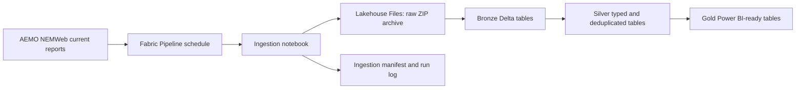
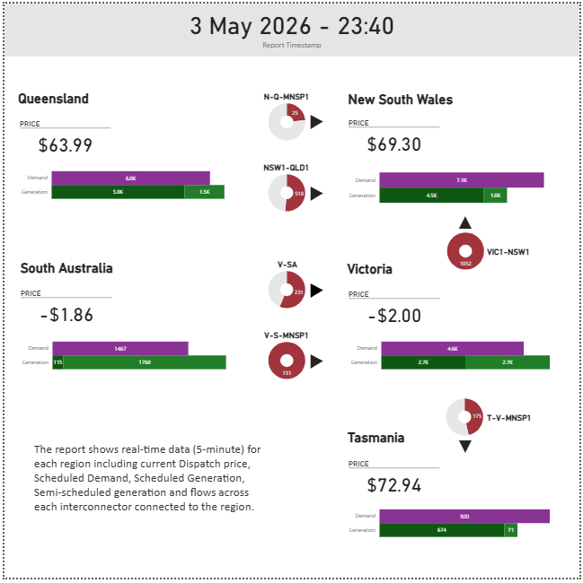

# Fabric NEMWeb Energy Market Data Pipeline

Work-in-progress Microsoft Fabric Lakehouse solution for ingesting public AEMO
NEMWeb current reports and preparing Power BI-ready Gold tables for a dashboard
similar to AEMO's NEM data dashboard.

## Project Purpose

The project demonstrates an end-to-end analytics workflow for Australian
electricity market data:

- Ingest NEMWeb ZIP files incrementally.
- Parse MMSDM-style CSV content.
- Store raw, Bronze, Silver, and Gold data in a Fabric Lakehouse pattern.
- Prepare clean Gold tables for Direct Lake or Import-mode Power BI reporting.
- Build an initial Power BI Desktop report, with more pages and visuals planned.
- Document manual Fabric setup where workspace binding cannot be represented in
  source control.

## Data Scope

The initial source focus is `DispatchIS_Reports`, because it provides useful
near real-time price, demand, regional dispatch, and interconnector records.
Additional configured sources include public prices, Unit SCADA,
generation-related reports, and future gas-market placeholders.

The source data is public NEMWeb data published by the Australian Energy Market
Operator (AEMO). This repository does not claim ownership of the AEMO/NEMWeb
source data.

## Architecture Summary

Raw ZIP files land in Lakehouse Files. Parsed MMSDM rows are written to Bronze
Delta tables with source metadata. Silver tables apply data types, region
mapping, deduplication, and table-specific shaping. Gold tables are designed for
Power BI with clean names, date/time helpers, price bands, event flags, KPI
tables, and data freshness outputs.

See `fabric/lakehouse_design.md` for detailed table layout and idempotency
strategy.

## Workflow Summary

The intended production workflow is:

1. Configure local and Fabric prerequisites.
2. Create and publish a Fabric Environment with required Python libraries.
3. Upload the reusable `nem_fabric` package to the Fabric notebook runtime path.
4. Publish notebooks and attach a Lakehouse and the Fabric Environment.
5. Run environment validation.
6. Run ingestion, Bronze parsing, Silver transformation, and Gold build notebooks.
7. Schedule the Fabric Pipeline every 5 minutes.
8. Build a Power BI semantic model and report from Gold tables.

See `fabric/deployment_steps.md` for exact deployment steps and
`fabric/pipeline_design.md` for orchestration details.

## Local Development

Local development is used for parser validation, tests, and smoke testing only.
Fabric remains the target runtime for Spark and Delta writes.

Key references:

- `environment.yml` and `scripts/run_tests.ps1` for local environment setup and
  validation.
- `.env.example` for documented environment variables.
- `scripts/local_smoke_test.py` for live NEMWeb parser validation.
- `tests/` for parser and client unit tests.

## Fabric and Package Deployment

Fabric Pipelines do not automatically include local Python source code. The
notebooks currently use the Lakehouse Files source-library approach for
`nem_fabric` imports.

Modules under `src/nem_fabric` use dependency prefixes: `common_` for shared
local/Fabric code, `fabric_` for Spark and Lakehouse implementations, and
`local_` for local filesystem implementations.

See `fabric/deployment_steps.md` for the available package deployment options,
exact library path behaviour, and the parameter used by notebooks.

## Power BI Output

The repository includes an initial Power BI Desktop report at
`powerbi/powerbi.pbix`. The report is a work in progress: the current file
demonstrates the first dashboard outputs, and more pages and visuals will be
added as the Gold tables and semantic model mature.

Due to the nearing expiry date of the available Fabric licence, the Power BI
file was created in Power BI Desktop rather than fully authored and published
through Fabric/Direct Lake. Gold tables are still shaped to support Direct Lake
where a Fabric-enabled workspace is available.

### Screenshots

Gold tables support or are intended to support report pages for:

- NEM Overview.
- Regional Prices.
- Demand and Supply.
- Generation Mix where source data allows.
- Interconnector Flows where source data allows.
- Price Events and Volatility.
- Data Operations.

See `powerbi/dashboard_pages.md`, `powerbi/semantic_model_tables.md`,
`powerbi/measures_dax.md`, and `powerbi/data_processing.md` for report design
and data-processing details.

## Current Limitations

- Fabric workspace, Lakehouse, notebook, Environment, Pipeline, and semantic
  model binding require manual Fabric UI steps.
- Fabric items are unavailable in Power BI Pro-only workspaces.
- The included PBIX was created in Power BI Desktop because the available
  Fabric licence was nearing expiry.
- Power BI report development is still in progress; more report pages will be
  added to the PBIX.
- Some NEMWeb folders may vary over time and should be validated in the target
  environment.
- Generation fuel classification depends on source availability or future
  mapping tables.

## Future Enhancements

- Additional Power BI report pages, screenshots, and public sharing.
- Archive backfill.
- Delta table optimisation and compaction.
- Automated semantic model deployment.
- Expanded generation, fuel, interconnector, and gas modelling.

## Licence

This project is proprietary portfolio work. AEMO/NEMWeb source data remains
owned by AEMO and/or the relevant original publisher, owner, or licensor. See
`LICENCE` for details.
