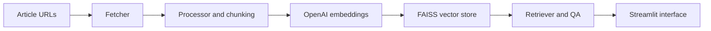

# GenAI Research Assistant (OpenAI, LangChain, Streamlit, FAISS)

## Overview

This project is a Streamlit-based research assistant that ingests article URLs, extracts content, converts it into vector embeddings, stores the embeddings in FAISS, and answers user questions over the retrieved text with OpenAI models.

## Demo Context

The application is a portfolio demonstration of a small retrieval-augmented generation workflow. It focuses on the mechanics of document ingestion, vector-store creation, retrieval, and question answering rather than on a proprietary internal knowledge base.

## What The Project Does



- Accepts one or more article URLs from the Streamlit sidebar
- Loads and cleans article content
- Splits documents into chunks and embeds them with OpenAI embeddings
- Persists a FAISS index for reuse across sessions
- Lets the user ask grounded questions about the processed content

## Repository Structure

```text
main.py
environment.yml
requirements.txt
pyproject.toml
src/
  restool/
    app.py
    config.py
    fetcher.py
    processor.py
    query.py
tests/
  test_fetcher.py
faiss_store_openai/
  index.faiss
  index.pkl
README.md
```

## Workflow

1. `main.py` boots the Streamlit application and exposes the local package.
2. `src/restool/app.py` manages the interface, session state, URL processing, and query flow.
3. `src/restool/fetcher.py` and `processor.py` load content and build the FAISS store.
4. `src/restool/query.py` handles retrieval and answer generation.

## Data Assets

- No proprietary article corpus is stored in the repository.
- `faiss_store_openai/` contains a locally persisted vector store created during prior runs and can be regenerated from new URLs.
- Tests are included for the fetching layer.

## Screenshots

### Initial View


### URLs Processed


### Query Answered


## Notes

- The project expects environment configuration for OpenAI access before use.
- It is intended as a concise RAG demo rather than a production knowledge platform.
