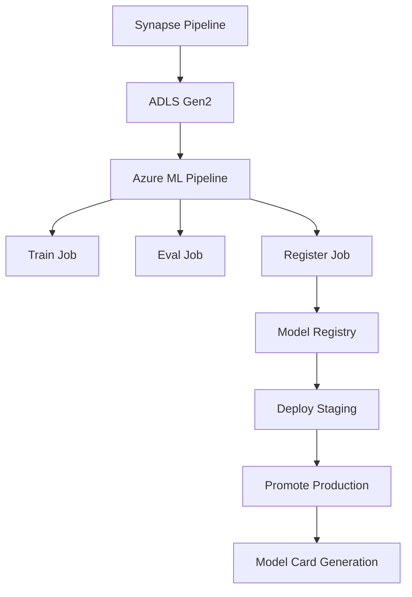

# Azure MLOps Pipeline with CI/CD and Model Registry

This repository implements a complete MLOps pipeline for machine learning model training, evaluation, registration, and deployment using Azure Machine Learning and GitHub Actions for CI/CD.

## Features

- **Data Processing**: Synapse Spark pipeline for data preparation
- **Model Training**: Automated ML pipeline with training and evaluation
- **Model Registry**: Versioned model storage and management
- **CI/CD**: GitHub Actions for automated deployment
- **Deployment**: Staging and production environments with traffic management
- **Model Cards**: Automated documentation generation

## Architecture



## Project Structure

```
project/
├── src/
│   ├── train.py
│   ├── train_spark.py
│   ├── evaluate.py
│   ├── evaluate_spark.py
│   ├── register.py
│   ├── deploy.py
│   ├── promote.py
│   ├── model_card.py
│   ├── score.py
│   └── common/
│       └── azure_ml_config.py
├── scripts/
│   ├── components/
│   │   ├── train/
│   │   │   ├── train.yml
│   │   │   └── train_spark.yml
│   │   ├── evaluate/
│   │   │   ├── evaluate.yml
│   │   │   └── evaluate_spark.yml
│   │   ├── deploy/
│   │   │   └── deploy_spark_batch.py
│   │   └── model_card/
│   │       └── model_card.yml
│   ├── pipelines/
│   │   ├── pipeline.yml
│   │   ├── pipeline_spark.yml
│   │   ├── submit_pipeline.py
│   │   └── submit_pipeline_spark.py
│   ├── inference/
│   │   ├── run_deployed_spark_MLmodel_on_Databricks.py
│   │   ├── run_deployed_spark_MLmodel_with_batch_endpoints.py
│   │   ├── run_managed_endpoints_with_Python_SDK.py
│   │   └── run_managed_endpoints_with_request.py
│   ├── deployment/
│   │   └── deploy_spark_batch.yml
│   └── utilities/
│       └── utils.py
├── environments/
│   └── conda.yml
├── tests/
│   ├── test_train.py
│   ├── test_evaluate.py
│   ├── test_utils.py
│   └── conftest.py
└── .github/
    └── workflows/
        ├── train.yml
        ├── train_spark.yml
        ├── deploy.yml
        ├── promote.yml
        └── ci.yml
```

## Setup

### Prerequisites

- Azure subscription with Azure ML workspace
- Azure Data Lake Storage Gen2
- Synapse Analytics workspace
- GitHub repository

### Environment Setup

1. Create the Conda environment:
   ```bash
   conda env create -f environments/conda.yml
   conda activate azure-mlops-env
   ```

2. Set environment variables:
   ```bash
   export AZURE_SUBSCRIPTION_ID=<your-subscription-id>
   export AZURE_RESOURCE_GROUP=<your-resource-group>
   export AZURE_ML_WORKSPACE=<your-ml-workspace>
   ```

### Configuration

Update the following files with your Azure resource details:
- `pipelines/submit_pipeline.py`: Update `processed_path` with your ADLS Gen2 URI
- Pipeline YAML files: Adjust compute targets and environments as needed

## Usage

### Local Development

1. Prepare data using Synapse pipeline
2. Submit training pipeline:
   ```bash
   python pipelines/submit_pipeline.py
   ```

### Using the Makefile

This project includes a `Makefile` to standardize common development tasks so everyone runs the same commands locally and in CI.

Run available targets:
```bash
make help
```

Common targets:

- `make install`: create the Conda environment and install pre-commit hooks
- `make lint`: run linting checks via pre-commit
- `make test`: run the test suite with pytest
- `make clean`: remove generated local artifacts and Windows `desktop.ini` files

If `make` is not available on your machine, run the equivalent commands directly from the `Makefile`.

### CI/CD Deployment

The repository includes GitHub Actions workflows for automated CI/CD:

- **Train**: Triggers on push to main, runs training pipeline
- **Deploy**: Deploys latest model to staging
- **Promote**: Promotes staging to production

## Components

### Training Pipeline

Executes the following steps:
1. **Train**: Trains model using processed data
2. **Evaluate**: Validates model performance
3. **Register**: Versions and registers model in Azure ML

### Deployment

Supports both real-time and batch endpoints:
- sklearn models → Real-time endpoints
- Spark MLlib models → Batch endpoints

## Model Selection Guide

| Scenario | Use Spark MLlib | Use sklearn/XGBoost |
|----------|-----------------|---------------------|
| Distributed training | ✅ | ❌ |
| Distributed scoring | ✅ | ❌ |
| Batch inference | ✅ | ✅ |
| Real-time inference | ❌ | ✅ |
| Online endpoints | ❌ | ✅ |
| Batch endpoints | ✅ | ✅ |

## Contributing

1. Fork the repository
2. Create a feature branch
3. Make changes
4. Run tests
5. Submit pull request

## License

This project is licensed under the MIT License.
