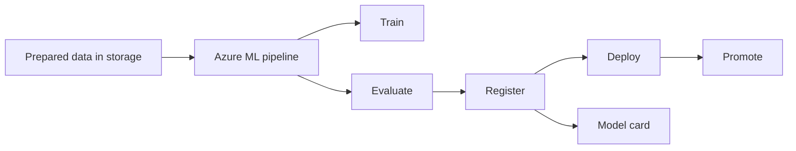

# Azure MLOps Pipeline with CI/CD and Model Registry

## Overview

This project demonstrates an Azure-based MLOps workflow for training, evaluating, registering, and deploying machine learning models with Azure Machine Learning and GitHub Actions. It includes both standard Python and Spark-oriented components together with pipeline definitions, deployment scripts, and automated checks.

## Demo Context

The repository is a portfolio sample of MLOps patterns rather than a direct export of a client production environment. It is designed to show environment setup, component orchestration, model governance, and promotion flow without exposing private cloud configuration or business data.

## What The Project Does



- Defines reusable Azure ML pipeline jobs for training, evaluation, and registration
- Includes Python and Spark-oriented training and evaluation entry points
- Supports model registration, deployment, endpoint scoring, and promotion logic
- Includes GitHub Actions workflow files for CI/CD orchestration
- Includes tests and environment definitions for repeatable local or CI execution

## Repository Structure

```text
src/
  train.py
  train_spark.py
  evaluate.py
  evaluate_spark.py
  register.py
  deploy.py
  promote.py
  model_card.py
  score.py
scripts/
  components/
  deployment/
  inference/
  pipelines/
  utilities/
environments/
  conda.yml
tests/
  test_utils.py
.github/
  workflows/
README.md
```

## Workflow

1. Data is prepared externally and passed into the Azure ML pipeline as a processed dataset.
2. `scripts/pipelines/` defines the orchestration for training, evaluation, and registration.
3. `src/` contains the executable Python entry points used by the components.
4. `scripts/deployment/` and `src/deploy.py` support deployment and promotion scenarios.
5. `.github/workflows/` provides CI/CD automation hooks.

## Data Assets

- No raw business dataset is committed to the repository.
- The pipeline definitions expect an external processed input dataset, typically supplied through Azure storage and Azure ML job inputs.
- The committed artefacts are code, configuration, tests, and workflow definitions.

## Notes

- The current implementation uses house-price style regression examples to illustrate the MLOps lifecycle.
- The repository is most useful for reviewing orchestration, component boundaries, and deployment automation structure.
