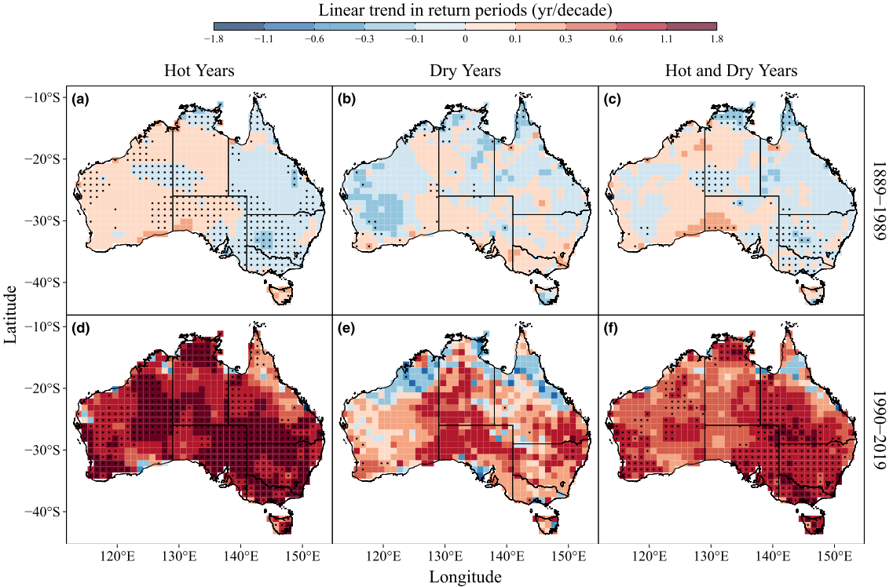
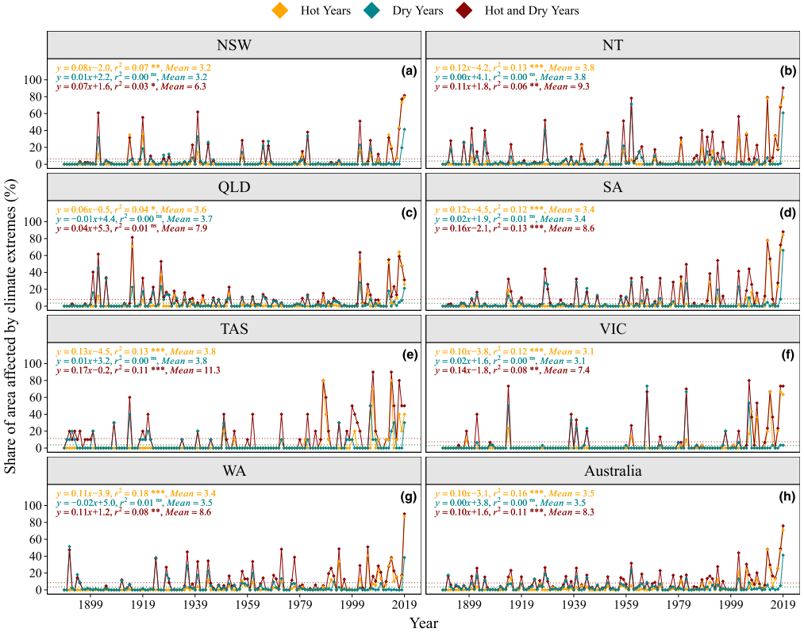
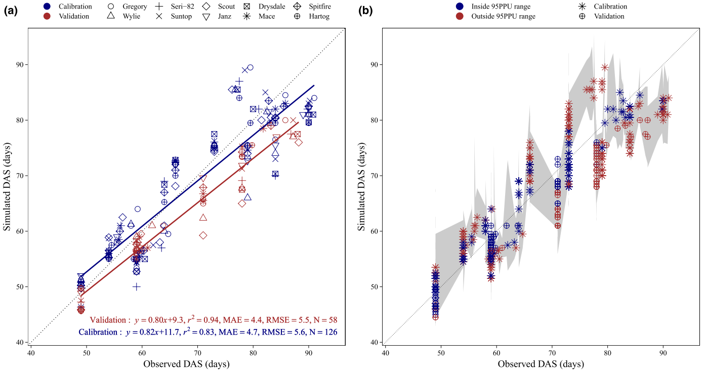
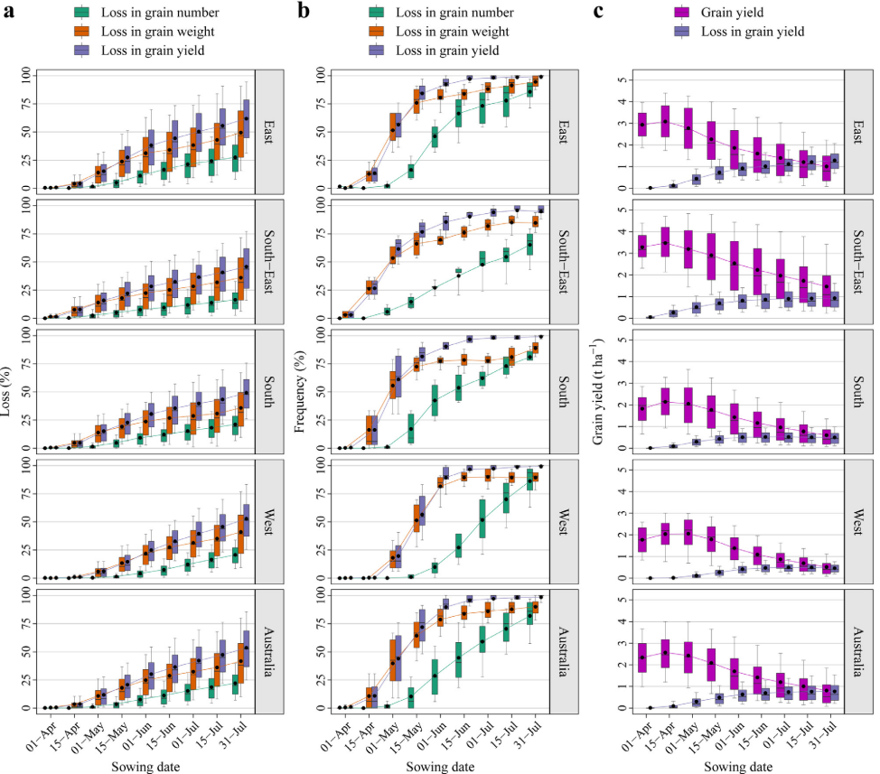
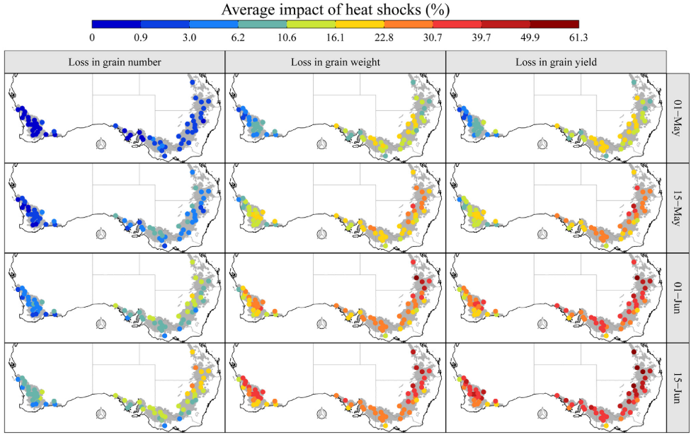
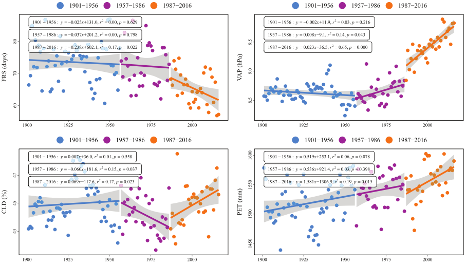
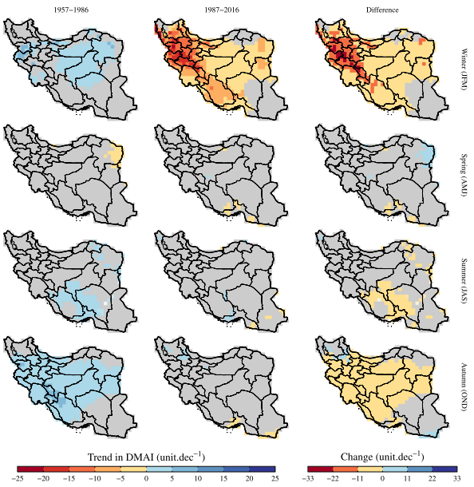
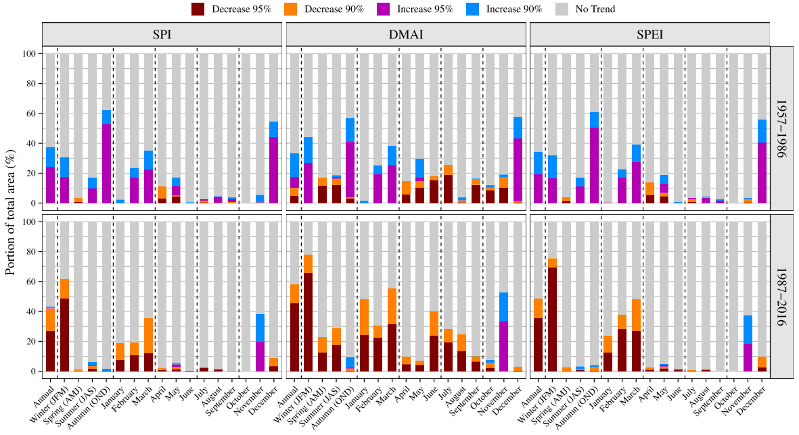
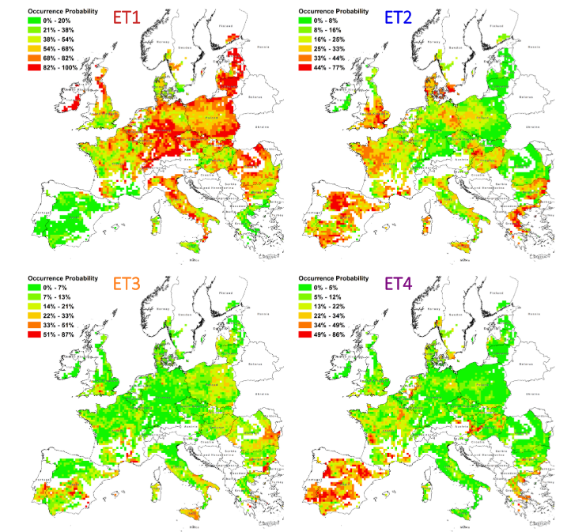
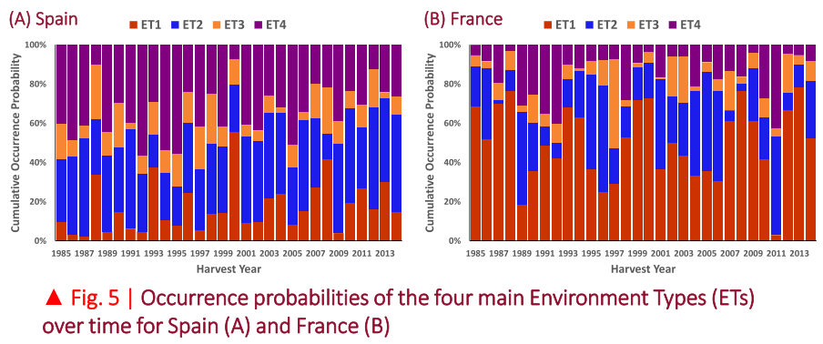

<h2><strong>Paper Title:</strong> Frequency of compound hot–­dry weather extremes has significantly increased in Australia since 1889</h2>

<strong>Caption:</strong> Trends in return periods of annual hot (a, d), dry (b, e) and compound hot-­and-­dry (CHD; c, f) extreme events over 1889–1989 and 1990–­2019. Dots show significant trends (p < 0.05).

<strong>Caption:</strong> Area affected by annual hot, dry and compound hot-­and-­dry (CHD) extreme events over 1889–­2019. ns: not significant, *p < .05, **p < .01, ***p <.001. Dotted lines signify the long-­term average area affected by each type of extremes. In some panels, the long-­term average lines of hot and dry extremes overlap.
  

 

<h2><strong>Paper Title:</strong> Contribution of climate models and APSIM phenological parameters to uncertainties in spring wheat simulations: Application of SUFI-­2 algorithm in northeast Australia</h2>

<strong>Caption:</strong> APSIM-­wheat calibration results with the SUFI-­2 M algorithm across three locations in northeast Australia (south-­eastern Queensland): (a) calibration for the 10 selected spring wheat cultivars; (b) uncertainty ranges in the simulated phenology along with the observed phenology for all the individual replications. Data were averaged across replications in panel (a). RMSE is the root mean square error, MAE is the mean absolute error and N is the number of data points. Observations included Zadoks growth stages from stem elongation (Z31) up to flowering (Z65). ‘Inside’ and ‘outside’ refer to the 95% prediction uncertainties (95PPU) range and whether the observed values fell within this range or not.

 

<h2><strong>Paper Title:</strong> Heat shocks increasingly impede grain filling but have little effect on grain setting across the Australian wheatbelt</h2>

<strong>Caption:</strong> Temporal trends in (a) averages of daily minimum, mean, and maximum temperatures, and in (b) the frequency of hot days occurring in the period from August to November over the years 1985 to 2017. Hot days (b) were defined as days with a maximum daily temperature (TMax) above a threshold of 26, 28 or 32 °C, respectively. Points circled in black represent significant trends (P<0.1).

10%" width="900">

<strong>Caption:</strong> Impacts of heat-shock on grain number, individual grain weight and grain yield (a), the frequency of impacts >10% (b), and grain yield and heat-shock induced yield loss (c) in four regions (East, South-East, South and West) and the whole Australian wheatbelt over the period from 1985 to 2017 for the mid-maturing cultivar Janz and nine sowing dates. For the boxplots, the middle line of the box represents the median; the upper and lower edges represent the 75th and 25th percentiles and the whiskers show the 10th and 90th percentiles. Black points correspond to the averages.

 

<h2><strong>Paper Title:</strong> Spatio-Temporal Variations of Seven Weather Variables in Iran: Application of CRU TS and GPCC Data Sets</h2>

<strong>Caption:</strong> Linear trends over the periods 1901–1956, 1957–1986 and 1987–2016 in national annual averages of frost day frequency (FRS), vapour pressure (VAP), cloud cover (CLD) and total potential evapotranspiration (PET). The magnitude of trends was estimated with the Theil–Sen approach after the trend-free pre-whitening (TFPW) procedure was applied.

 

<h2><strong>Paper Title:</strong> Investigating climate change over 1957–2016 in an arid environment with three drought indexes</h2>

<strong>Caption:</strong> Temporal trends in seasonal DMAI over 1957–1986 and 1987–2016. Grid cells shown in gray revealed insignificant trends (P&gt;0.1), determined with the Mann–Kendall test. Right panel shows the subtraction of the trends over 1987–2016 from the trends over 1957–1986. Differences between the two periods are only shown for grid cells where at least one period experienced a significant trend.

<strong>Caption:</strong> The portion of the grid cells (i.e., Iran’s total area) where significant trends were detected in the annual, seasonal, and monthly time series of the SPI, DMAI, and SPEI at two confidence levels of 90 and 95%.

 

<h2><strong>Poster Title:</strong> Poster Title: Typology of Drought Stress Scenarios at European Level for Wheat</h2>

<strong>Caption:</strong> Spatial variability of the occurrence probabilities of the four main Environment Types (ETs) identified across Europe.

<strong>Caption:</strong> Occurrence probabilities of the four main Environment Types (ETs) over time for Spain (A) and France (B).

