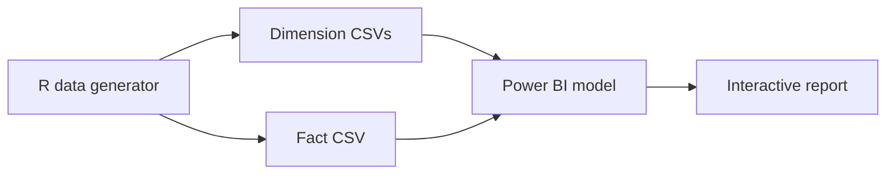

# Power BI E-Commerce Sales Dashboard

## Overview

This project is a self-contained Power BI analytics sample built on top of a synthetic e-commerce star schema. It includes a Power BI Desktop dashboard, an R script that generates the dummy data, and the exported dimension and fact CSV files used by the report.

## Demo Context

The data in this folder is intentionally synthetic so that the full BI workflow can be reviewed without sharing proprietary operational data. The project is meant to show data modelling, dummy-data generation, and dashboard preparation patterns.

## What The Project Does



- Generates a dummy e-commerce star schema with R
- Produces multiple dimensions together with a sales fact table
- Loads the model into Power BI Desktop for analysis and visualisation

## Repository Structure

```text
RCode.R
DimChannel.csv
DimCity.csv
DimCustomer.csv
DimDate.csv
DimPayment.csv
DimProduct.csv
DimPromotion.csv
FactSales.csv
Sample 1.pbix
README.md
```

## Data Assets

- `RCode.R` generates the synthetic star-schema data.
- The dimensions cover channel, city, customer, date, payment, product, and promotion.
- `FactSales.csv` contains the transactional fact table used by the Power BI model.
- `Sample 1.pbix` is the report file built on top of those datasets.

## Screenshots

### Overview Page


### Detail Page


## Notes

- The dataset uses dummy values and is intended for demonstration only.
- This folder showcases semantic modelling and BI packaging rather than data engineering orchestration.
