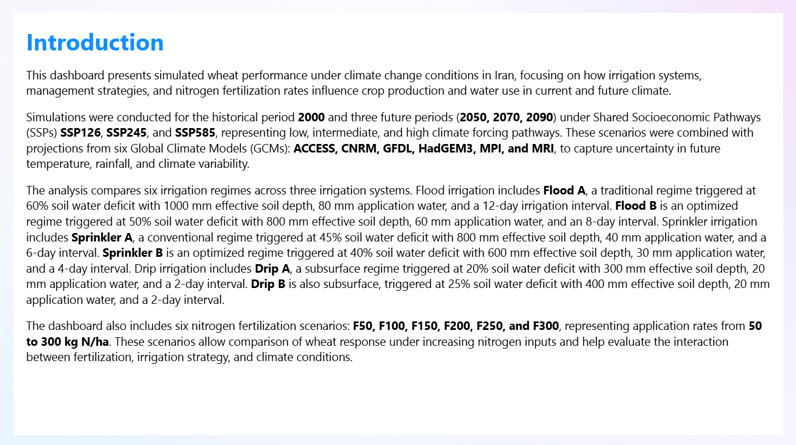
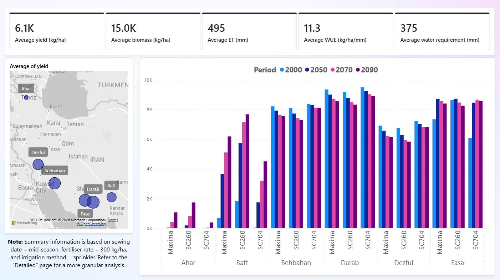
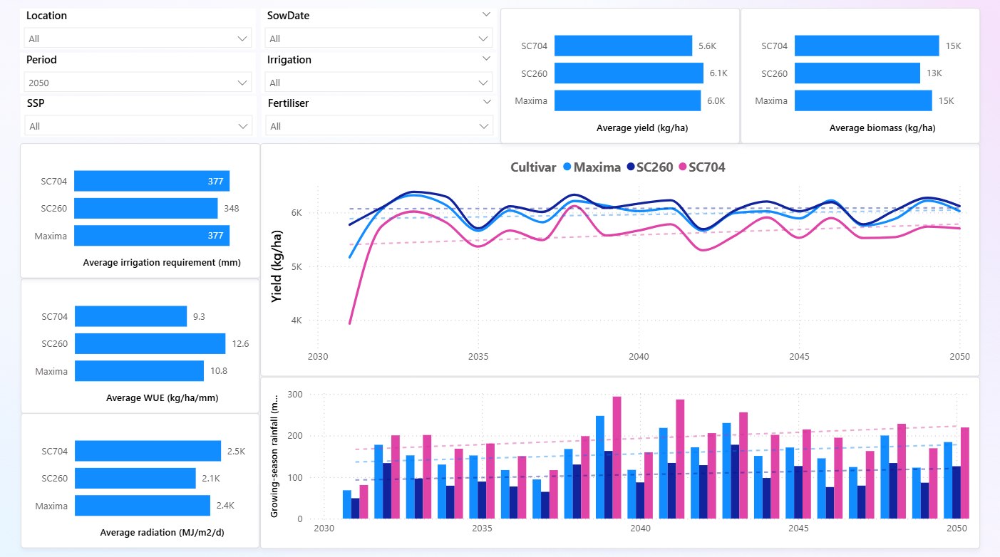

# Power BI Maize Performance under Climate Change in Iran

## Overview

This project is a Power BI analytics sample exploring simulated maize performance in Iran under historical and future climate conditions. It combines crop simulation outputs for three maize cultivars with distinct maturity habits with sowing date, irrigation, nitrogen fertilisation, climate scenario, and Global Climate Model dimensions to support interactive comparison of yield and water-use outcomes.

## Demo Context

The dashboard is intended as a portfolio example of agricultural data modelling, climate scenario analysis, and Power BI reporting. The underlying data is owned by Dr Brian Collins and is included only for review of this project. It must not be used, copied, shared, analysed, republished, or reused for any purpose without prior written permission.

## Screenshots







## What The Project Does

- Compares maize performance across historical conditions and future climate scenarios
- Includes historical climate (`2000`) as well as three future climate scenarios representing the `2050`, `2070`, and `2090` periods
- Includes three Shared Socioeconomic Pathways: `SSP126`, `SSP245`, and `SSP585`
- Uses multiple GCM projections, including `ACCESS`, `CNRM`, `GFDL`, `HadGEM3`, `MPI`, and `MRI`
- Compares flood, sprinkler, and drip irrigation systems across defined management regimes
- Includes three maize cultivars: `SC260` (early-maturing), `Maxima` (mid-maturing), and `SC704` (late-maturing)
- Evaluates three sowing dates: `early` (20 days before the conventional sowing date), `conventional`, and `late` (20 days after).
- Evaluates nitrogen fertilisation scenarios from `F50` to `F300`, representing 50 to 300 kg N/ha
- Presents results through an interactive Power BI report

## Irrigation Scenarios

The dashboard compares six irrigation regimes:

- `Flood A`: traditional flood irrigation, 60% soil water deficit trigger, 1000 mm effective soil depth, 80 mm application water, 12-day interval
- `Flood B`: optimised flood irrigation, 50% soil water deficit trigger, 800 mm effective soil depth, 60 mm application water, 8-day interval
- `Sprinkler A`: conventional sprinkler irrigation, 45% soil water deficit trigger, 800 mm effective soil depth, 40 mm application water, 6-day interval
- `Sprinkler B`: optimised sprinkler irrigation, 40% soil water deficit trigger, 600 mm effective soil depth, 30 mm application water, 4-day interval
- `Drip A`: subsurface drip irrigation, 20% soil water deficit trigger, 300 mm effective soil depth, 20 mm application water, 2-day interval
- `Drip B`: subsurface drip irrigation, 25% soil water deficit trigger, 400 mm effective soil depth, 20 mm application water, 2-day interval

## Crop Modelling

The simulations were conducted using the Agricultural Production Systems Simulator, APSIM version 7.10 (Holzworth et al., 2014), to model maize growth and yield in Iran. APSIM simulates daily crop development from planting to maturity, with biomass accumulation constrained by radiation use efficiency and transpiration efficiency, and influenced by temperature, nitrogen availability, and soil moisture. Dry matter allocation changes across growth stages, with greater allocation to leaves before flowering and to grain after flowering.

## Repository Structure

```text
data/
  Seasonal.parquet
powerbi/
  powerbi.pbix
screenshots/
  S1.png
  S2.png
  S3.png
README.md
LICENCE
```

## Data Assets

- `data/Seasonal.parquet` contains the seasonal simulation data used by the report.
- `powerbi/powerbi.pbix` is the Power BI Desktop report.

## Notes

- This project is provided for demonstration and portfolio review only.
- All data remains the property of Dr Brian Collins.
- No permission is granted to use the data in any sense without prior written permission.
