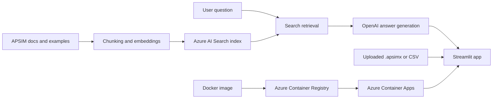

# Python - APSIM CoPilot (RAG, Azure, OpenAI, Docker, Container App)

## Overview

This project is a portfolio demo of an end-to-end Retrieval-Augmented Generation application for [APSIM](https://www.apsim.info/) users. It combines a Streamlit UI, OpenAI models, Azure AI Search, Azure Blob Storage, Azure Key Vault, Docker, Azure Container Apps, and helper scripts for indexing and deployment.

The purpose is to show a coherent implementation path from local development through Azure deployment. It is not intended to present a production-grade agronomic assistant or a fully validated APSIM interpretation engine.

Live demo:

- [APSIM Copilot on Azure Container Apps](https://apsim-copilot.proudsky-2a520531.australiaeast.azurecontainerapps.io)

## About APSIM

The Agricultural Production Systems sIMulator (APSIM) is internationally recognised as a highly advanced platform for modelling and simulation of agricultural systems. It contains a suite of modules that enable the simulation of systems for a diverse range of plant, animal, soil, climate and management interactions. APSIM is undergoing continual development, with new capability being added to APSIM Next Generation. Its development and maintenance is underpinned by rigorous science and software engineering standards. The APSIM Initiative was established in 2007 to promote the development and use of the science modules and infrastructure software of APSIM. The current members are CSIRO, The State of Queensland, The University of Queensland, AgResearch Ltd. (NZ), University of Southern Queensland, Iowa State University, (US) and Plant and Food Research (NZ)

## Demo Context

This repository snapshot is designed to demonstrate:

- a small but complete RAG application architecture
- Azure service integration and secret handling
- document ingestion and indexing workflows
- Docker build and Azure Container Apps deployment automation
- a clean Python project structure with tests and operational scripts

Two parts of the app are intentionally lightweight:

1. Explaining a parsed `.apsimx` file  
   This uses a minimal heuristic parser and then asks the LLM to explain the extracted structure. It is useful for demonstration, but only a minimum attempt has been made to provide deep APSIMX understanding or schema-complete interpretation.

2. Summarising a CSV analysis payload  
   This uses basic `pandas` inspection, simple descriptive statistics, and a lightweight prompt. It is useful for demonstrating workflow shape, but it is not a sophisticated APSIM analytics engine.

## What The Project Does



- Answers APSIM questions using retrieval over indexed APSIM documentation
- Parses uploaded `.apsimx` files into a compact structured summary
- Summarises uploaded APSIM output CSV files with a minimal analysis payload
- Supports local development and Azure-hosted deployment
- Uses Azure Key Vault or direct runtime secrets depending on deployment mode

## Repository Structure

```text
app/
  models/
  services/
  ui/
  utils/
  config.py
  logging_config.py
  main.py
docs/
  dc_architecture.md
  dc_deploy_container_apps.md
  dc_ingest_docs.md
  dc_setup_azure_portal.md
  dc_setup_local.md
sample_data/
  docs/
  apsimx/
  csv/
scripts/
  sc_01_create_search_index.py
  sc_02_fetch_apsim_docs.py
  sc_03_upload_docs_to_blob.py
  sc_04_index_documents.py
  sc_05_refresh_docs_index.py
  sc_06_smoke_test.py
tests/
bt_build_push_acr.bat
bt_deploy_container_app.bat
Dockerfile
environment.yml
README.md
LICENSE
```

## Architecture Summary

- `Streamlit` provides the three-tab web UI
- `OpenAI API` handles chat completions and embeddings
- `Azure AI Search` stores retrieval chunks for APSIM question answering
- `Azure Blob Storage` stores source docs and optional user uploads
- `Azure Key Vault` can hold runtime secrets for local or deployed use
- `Docker` packages the app
- `Azure Container Registry` stores built images
- `Azure Container Apps` hosts the deployed demo

See [docs/dc_architecture.md](docs/dc_architecture.md) for the architecture note.

## Local Workflow

1. Create the environment:

```powershell
conda env create -f environment.yml
```

2. Activate it:

```powershell
conda activate apsim-copilot
```

3. Create your local env file:

```powershell
Copy-Item .env.example .env
```

4. Start the app:

```powershell
streamlit run app/main.py
```

Step-by-step local setup is documented in [docs/dc_setup_local.md](docs/dc_setup_local.md).

## Retrieval Corpus Setup

If you already have local APSIM documentation files under `sample_data/docs`, the usual setup sequence is:

```powershell
python scripts/sc_01_create_search_index.py
python scripts/sc_03_upload_docs_to_blob.py --source-dir sample_data/docs
python scripts/sc_04_index_documents.py --topic apsim
python scripts/sc_06_smoke_test.py
```

If you want to fetch APSIM documentation automatically:

```powershell
python scripts/sc_02_fetch_apsim_docs.py
python scripts/sc_05_refresh_docs_index.py
```

If you use the dynamic fetcher for `docs.apsim.info`, install Playwright’s Chromium browser once after creating the Conda environment:

```powershell
python -m playwright install chromium
```

Detailed instructions are in [docs/dc_ingest_docs.md](docs/dc_ingest_docs.md).

## Azure Deployment Workflow

Build and push an image:

```powershell
.\bt_build_push_acr.bat
```

Deploy or update the Container App:

```powershell
.\bt_deploy_container_app.bat
```

The deployment batch scripts now support:

- timestamped image tags when `IMAGE_TAG=USEDATE`
- Log Analytics workspace creation
- Container Apps environment creation
- managed identity-based ACR pulls
- direct secrets or Key Vault-backed configuration

Deployment documentation:

- [docs/dc_setup_azure_portal.md](docs/dc_setup_azure_portal.md)
- [docs/dc_deploy_container_apps.md](docs/dc_deploy_container_apps.md)

## What Is Intentionally Minimal

The app is strongest as a deployment and integration demo. The two analysis-style features are deliberately simple:

- `.apsimx` explanation relies on heuristic extraction from JSON-like APSIMX structure, not a full APSIM schema-aware interpreter
- CSV summarisation relies on basic shape inspection, numeric summaries, and a small prompt payload, not a domain-rich APSIM results analysis engine

This limitation is intentional and should be read as part of the demo scope, not as hidden project debt.

## Tests

Run the local test suite:

```powershell
python -m pytest tests
python scripts/sc_06_smoke_test.py
```

## Licence

This project includes a proprietary portfolio licence in [LICENSE](LICENSE).

It is provided as a demonstration of an end-to-end RAG and Azure deployment implementation, not as an open-source framework or a production agronomic decision-support tool.
