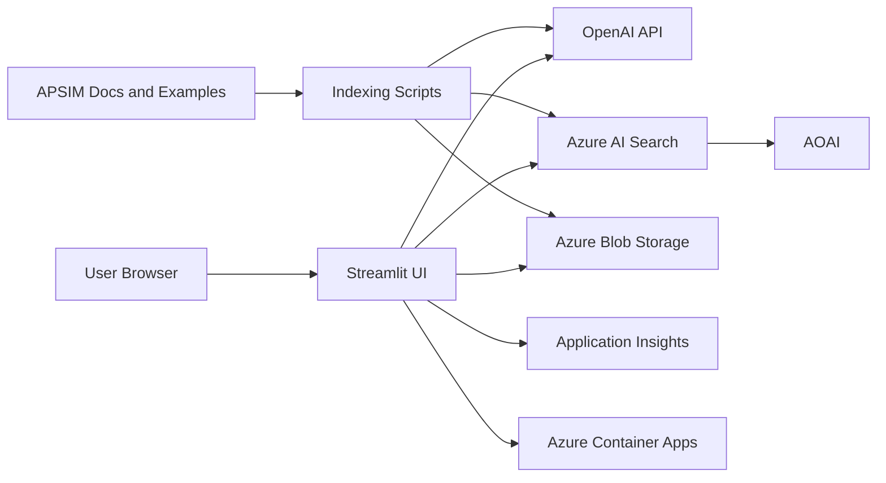

# Architecture

## Overview

APSIM Copilot is a single-container Python web app designed for a resume-friendly demo. It keeps the architecture intentionally small while still using real Azure building blocks where they add value.

## Components

### Streamlit UI

The UI is a single app with three tabs:

1. Ask APSIM
2. Explain `.apsimx`
3. Summarise CSV

The sidebar shows configuration state so you can quickly tell whether Azure services are wired up.

### OpenAI API

Used for:

- embeddings for indexed APSIM documentation
- grounded chat responses for APSIM Q&A
- plain-English explanation of `.apsimx` structure
- plain-English summaries of CSV analysis

### Azure AI Search

Used as the retrieval store for chunked APSIM docs and examples.

The app uses a simple hybrid-friendly pattern:

- standard search text
- vector query against `content_vector`

### Azure Blob Storage

Used for:

- storing APSIM documentation uploads
- optionally saving uploaded `.apsimx` and CSV files from the app

### Application Insights

Used for:

- structured logging
- optional telemetry hooks

If telemetry is not configured, the app still runs with standard Python logging.

### Azure Container Apps

Used to host the containerised Streamlit app with public ingress for demo purposes.

## Request Flows

### 1. APSIM Q&A with RAG

1. User asks a question in Streamlit.
2. The app creates an embedding for the question with the OpenAI API.
3. The app queries Azure AI Search for relevant document chunks.
4. The app builds a grounded prompt with the question and retrieved chunks.
5. The OpenAI API returns an answer.
6. The UI shows the answer and source chunks.

### 2. Explain `.apsimx`

1. User uploads a `.apsimx` file.
2. The app parses it as JSON.
3. The parser heuristically extracts simulation name, clock, crops, soils, weather, manager rules, outputs, and zones where possible.
4. The app sends the structured summary to the OpenAI API.
5. The UI shows the plain-English explanation and the raw JSON summary.

### 3. Summarise CSV

1. User uploads one or more CSV files.
2. `pandas` reads the file.
3. The app identifies numeric columns and likely APSIM signals such as yield, biomass, rain, runoff, soil water, and nitrogen.
4. The app calculates descriptive statistics and simple group comparisons.
5. The app sends that analysis payload to the OpenAI API.
6. The UI shows the narrative summary, preview table, and minimal charts.

## Design Choices

### Why a Single App

This is easier to explain and cheaper to run than a distributed architecture. It is enough to demonstrate:

- OpenAI API integration
- Azure AI Search retrieval
- Azure Storage integration
- container deployment
- practical Python service modularity

### Why No Database

The app does not need relational persistence for the requested features. Blob Storage is enough for optional uploaded file retention.

### Why No LangChain

The prompts, retrieval, and SDK calls are explicit and readable. That makes the demo easier to understand in interviews and easier to maintain.

### Why Heuristic `.apsimx` Parsing

APSIMX files can vary in shape. A lightweight heuristic parser is more practical for a demo than a rigid full-schema parser.

## Operational Notes

- Secrets come from environment variables.
- The container listens on port `8501`.
- The search index vector dimension must match the embeddings model.
- The app is public by design for demonstration and does not implement authentication.

## Limitations

- No APSIM execution or simulation running
- No user authentication
- No background processing
- Retrieval quality depends on document quality
- `.apsimx` parsing aims for useful explanation, not full APSIM schema coverage
