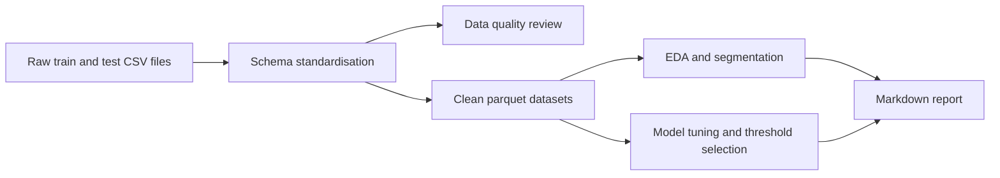

# Customer Churn Analysis

## Overview

This project is a notebook-first Python churn-analysis workflow built from labelled training and testing CSV files. It demonstrates a polished analytics pipeline covering raw-data review, data cleaning, exploratory analysis, customer segmentation, model comparison, threshold selection, and markdown reporting.

## Demo Context

This repository is a portfolio sample rather than a production retention system. The goal is not to squeeze out the single best possible churn model, but to show a clear end-to-end workflow with clean structure, reusable helper code, and stakeholder-friendly outputs.

The project also keeps the original provided train/test split instead of recombining both files and creating a new stratified split. That preserves the dataset as supplied and makes split-shift analysis visible, but it is also one plausible reason the final model performance is lower than it might be on a fresh same-distribution split.

## What The Project Does



- Standardises the raw schema and removes the single fully blank training row
- Treats both source files as labelled train/test splits
- Drops rows without a valid `Churn` label during cleaning
- Persists cleaned train, test, and combined parquet datasets
- Produces summary tables, visualisations, and customer-segmentation views
- Compares selected churn models and documents the results in `reports/report.md`

## Workflow

1. Create the environment with `conda env create -f environment.yml`.
2. Activate it with `conda activate churn-analysis`.
3. Run `make notebook` or `make lab`, or open Jupyter manually.
4. Use `notebooks/01_customer_churn_analysis.ipynb` for raw-data review, data-quality checks, cleaning outputs, EDA, and segmentation.
5. Use `notebooks/02_customer_churn_modeling.ipynb` for model tuning, evaluation, threshold selection, and report updates.

If PowerShell raises an activation error, run `conda init powershell`, reopen the terminal, and try `conda activate churn-analysis` again.

## Repository Structure

```text
data/
  about_data.txt
  kaggle_link.url
  customer_churn_dataset-training-master.csv
  customer_churn_dataset-testing-master.csv
  train.parquet
  test.parquet
  combined.parquet
notebooks/
  01_customer_churn_analysis.ipynb
  02_customer_churn_modeling.ipynb
outputs/
  figures/
  models/
  tables/
reports/
  report.md
src/
  customer_churn_analysis/
    analysis.py
    config.py
    data.py
    modeling.py
    visualization.py
environment.yml
Makefile
README.md
```

## Data Notes

- The repository includes the labelled training and testing CSV files used in the demo.
- `load_clean_train_test()` applies schema standardisation and cleaning before creating the analysis-ready datasets.
- Because this project assumes labelled train/test inputs, rows with missing `Churn` values are removed during cleaning.
- The data quality review in the `01` notebook and the report summary is based on the original raw inputs before final cleaned parquet outputs are written.

## Modelling Notes

- The modelling notebook is intended to demonstrate comparison and evaluation workflow, not leaderboard-style optimisation.
- The original provided test split is kept as the main evaluation set.
- The set of models compared can be adjusted in the notebook and helper code depending on the experiment you want to show.
- The report highlights that train/test distribution shift is a meaningful finding and a likely contributor to weaker external model performance.

## Outputs

- Cleaned parquet datasets in `data/`
- Figures in `outputs/figures/`
- Saved models in `outputs/models/`
- Summary tables in `outputs/tables/`
- Narrative markdown report in `reports/report.md`

## Notes

- `report.md` includes separate update timestamps showing when the analysis notebook and modelling notebook last refreshed their sections.
- The helper modules in `src/customer_churn_analysis/` are intentionally simple and notebook-oriented so the workflow remains easy to follow in a portfolio setting.

## Data Source

The raw dataset files used in this project come from Kaggle. A link to the source page is included in `data/kaggle_link.url`.
