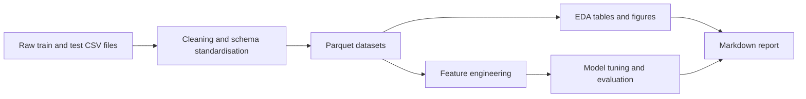

# Customer Churn Analysis

## Overview

This project is a Python-based customer churn analysis workflow that turns labelled training and testing CSV files into cleaned parquet datasets, exploratory analysis outputs, reusable charts, and a comparative machine-learning report.

## Demo Context

The repository is structured as a portfolio sample rather than as a production retention system. It is designed to show clean project organisation, notebook-based analysis, and model comparison without depending on private infrastructure or proprietary business context.

## What The Project Does

- Standardises the raw schema and removes the single fully blank training record
- Persists cleaned train, test, and combined datasets in parquet format
- Produces summary tables and presentation-ready churn visualisations
- Segments customers by tenure, payment behaviour, usage, support demand, and value bands
- Tunes and compares logistic regression, random forest, and histogram-based gradient boosting models

## Workflow

1. Create the Conda environment with `conda env create -f environment.yml`.
2. Activate it with `conda activate churn-analysis`.
3. Open `notebooks/01_customer_churn_analysis.ipynb` for the exploratory analysis and data-quality walkthrough.
4. Open `notebooks/02_customer_churn_modeling.ipynb` for model tuning, evaluation, and report generation.

If PowerShell raises an activation error, run `conda init powershell`, reopen the terminal, and try `conda activate churn-analysis` again. You can also use `make setup`, `make notebook`, or `make lab`.

## Data Assets

- The repository includes the labelled training and testing CSV files used in the demo.
- Cleaned parquet copies are written to `data/` for faster reloads during analysis.
- Generated figures, model artifacts, and summary tables are stored under `outputs/`.
- The markdown summary in `reports/report.md` can be refreshed from the modelling notebook when you run its report-writing step.

## Notes

- Both source files include a `Churn` label, so the project treats them as labelled train/test splits rather than as an unlabeled inference dataset.
- The train and test splits differ meaningfully in churn prevalence and several feature averages, so split-comparison analysis is a central part of the project.
- The repository is best reviewed as a polished analytics and modelling sample rather than as a deployed application.
