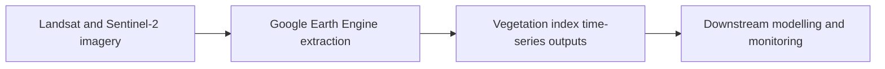

# Python - Remote Sensing and Image Processing (Google Earth Engine, Landsat, Sentinel-2)

## Overview

This project contains Google Earth Engine scripts used in a crop-monitoring workflow for Vietnam. The scripts extract vegetation indices from Landsat and Sentinel-2 imagery for rice, mango, and dragonfruit production areas.

## Demo Context

The broader initiative included additional image-processing, machine-learning, and delivery components across multiple partner organisations. This repository snapshot contains the shareable Earth Engine extraction scripts that formed part of that larger workflow.

## Tools Used

- Python for data handling and preprocessing workflows in the wider project context
- Google Earth Engine for satellite-data access and scripted remote-sensing extraction
- Landsat and Sentinel-2 imagery as the primary satellite sources represented here
- Vegetation-index extraction workflows for crop-monitoring feature engineering

## What The Project Does



- Extracts vegetation-index data for multiple crop types
- Uses separate scripts for sensor and crop combinations
- Supports downstream dataset preparation for crop monitoring and yield-modelling tasks

## Repository Structure

```text
01_Image_Processing/
  A4I064_J1_GEE_Extract_VIs_for_Dragonfruit_from_Landsat_Polygon.js
  A4I064_J1_GEE_Extract_VIs_for_Mango_from_Landsat_Polygon.js
  A4I064_J1_GEE_Extract_VIs_for_Rice_from_Landsat_Polygon.js
  A4I064_J2_GEE_Extract_VIs_for_Dragonfruit_from_Sentinel2_Polygon.js
  A4I064_J2_GEE_Extract_VIs_for_Mango_from_Sentinel2_Polygon.js
  A4I064_J2_GEE_Extract_VIs_for_Rice_from_Sentinel2_Polygon.js
README.md
```

## Data Assets

- No local raster archive is committed in this repository snapshot.
- The scripts are designed to operate in Google Earth Engine against satellite collections and study-area polygons configured in the code or linked assets.

## Notes

- This folder represents the remote-sensing extraction portion of the project that can be shared publicly.
- It is best reviewed as a preprocessing component rather than a complete end-to-end application.
