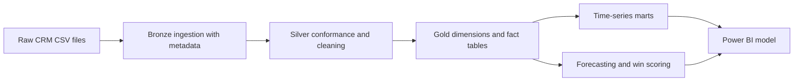

# CRM Revenue Intelligence And Pipeline Analytics

## Overview

This project is an end-to-end Python analytics workflow for CRM, sales-pipeline, customer, and product performance analysis. It uses a medallion architecture with Bronze, Silver, and Gold layers and produces Power BI-ready outputs in both Parquet and CSV.

The implementation is built around the public Maven Analytics CRM Sales Opportunities dataset and is structured to show practical experience in revenue intelligence, pipeline reporting, time-aware KPI modelling, and BI handoff. A Power BI dashboard is being prepared and will be added to this project.

## Demo Context

This repository is a portfolio sample rather than a production CRM platform. The goal is to demonstrate sound analytics-engineering and data-engineering practice using a realistic public dataset, while documenting source limitations instead of fabricating missing CRM objects.

The source dataset supports accounts, products, sales reps, and opportunities well. It does not include native contacts, leads, activity history, or detailed stage-history events, so those gaps are handled explicitly in the documentation and modelling approach.

Minimal effort has been spent polishing the generated figures and tables in `reports/`. They are included primarily as validation artefacts for checking the data and logic that will feed the Power BI dashboard, not as the final presentation layer.

## What The Project Does



- Ingests public CRM-style source files into a medallion folder structure
- Standardises schema, fixes known data issues, and derives conformed entities
- Builds a central `gold_dim_date` table for time intelligence
- Produces Power BI-ready dimensions, facts, monthly marts, and yearly summaries
- Calculates pipeline, weighted pipeline, win rate, average deal size, sales cycle, cohort, and product metrics
- Answers common business questions directly through Gold marts and a KPI summary table
- Adds opportunity win-probability scoring and monthly revenue forecasting
- Exports Gold outputs as both Parquet and CSV
- Writes data-quality summaries, model metrics, and charts to `reports/`
- Keeps the notebook walkthrough aligned with the same summary-metric logic used by the Python pipeline

## Workflow

1. Create the environment with `conda env create -f environment.yml`.
2. Activate it with `conda activate crm-revenue-intelligence`.
3. Run the pipeline with `python -m src.pipeline`.
4. Review Gold outputs in `data/gold/`.
5. Use `docs/power_bi_guide.md` to import the model into Power BI.
6. Use `notebooks/crm_pipeline_walkthrough.ipynb` for quick inspection of the outputs and to reproduce the same summary-card metrics shown by the pipeline.

If PowerShell raises an activation error, run `conda init powershell`, reopen the terminal, and try `conda activate crm-revenue-intelligence` again.

## Repository Structure

```text
data/
  raw/
  bronze/
  silver/
  gold/
docs/
  data_dictionary.md
  executive_summary.md
  metric_definitions.md
  power_bi_guide.md
  time_modelling_approach.md
notebooks/
  crm_pipeline_walkthrough.ipynb
reports/
  data_quality_summary.json
  model_metrics.json
  monthly_revenue_trend.png
  pipeline_value_over_time.png
  customer_cohort_heatmap.png
  revenue_forecast.png
src/
  analytics_modeling.py
  analytics_visuals.py
  config.py
  io_files.py
  layer_bronze.py
  layer_gold.py
  layer_silver.py
  pipeline.py
  quality_checks.py
  raw_ingestion.py
environment.yml
pyproject.toml
README.md
LICENSE
.gitignore
```

## Data Notes

- Raw source files are stored in `data/raw/`.
- The source dataset was published by Maven Analytics and is publicly mirrored.
- The model uses these source tables:
  - `accounts.csv`
  - `products.csv`
  - `sales_pipeline.csv`
  - `sales_teams.csv`
- Account coverage in the opportunity table is incomplete in the public source, so unmatched accounts remain a documented quality limitation.
- Opportunities with missing dates are retained where feasible, but null-period rows are excluded from time-series marts to keep Gold outputs BI-safe.

## Time Modelling Notes

- `gold_dim_date` is the central date dimension for reporting and Power BI time intelligence.
- Standardised lifecycle fields include `created_date`, `close_date`, and `activity_date`.
- Derived temporal metrics include:
  - `days_to_close`
  - `opportunity_age_days`
  - `created_year_month`
  - `close_year_month`
  - 3-month and 6-month rolling averages
  - monthly customer cohorts
- Gold marts are designed to support monthly trends, yearly summaries, quarter-over-quarter comparisons, and forecasting.
- Formal definitions for derived metrics are documented in `docs/metric_definitions.md`.

## Business Questions Answered

- Win rates: `gold_mart_kpi_summary` and `gold_mart_sales_performance` show overall and monthly win rates.
- Sales cycle: `gold_fct_closed_deals`, `gold_mart_sales_performance`, and `gold_mart_pipeline_conversion` expose average `days_to_close`.
- Sales performance versus targets: `gold_mart_sales_performance_by_rep` and `gold_mart_sales_performance_by_team` include derived monthly revenue targets, attainment ratios, and an `exceeded_target` flag.
- Pipeline health: `gold_fct_pipeline_snapshot`, `gold_mart_sales_performance`, and `gold_mart_kpi_summary` show potential revenue by stage, including the current value in `Engaging`.
- Similar questions such as monthly closed-won revenue, weighted pipeline, stage conversion, customer cohort behaviour, and product trends are covered by the Gold marts in `data/gold/`.

Target note:

- The source dataset does not include explicit quotas or sales targets.
- This project derives portfolio-style monthly revenue targets from each rep's and team's trailing 3-month actual performance so target-attainment analysis is still demonstrable and clearly documented.

## Outputs

- Gold dimensions and fact tables in `data/gold/`
- Bronze and Silver datasets in `data/bronze/` and `data/silver/`
- Data-quality summary in `reports/data_quality_summary.json`
- Model performance summary in `reports/model_metrics.json`
- Charts in `reports/`
- Summary-card metrics in `reports/metrics/summary_card_metrics.json`
- Power BI modelling guidance in `docs/power_bi_guide.md`
- Metric definitions in `docs/metric_definitions.md`

## How This Demonstrates CRM And Pipeline Analytics Experience

- Models CRM entities into conformed dimensions and time-aware facts.
- Uses medallion architecture with traceable raw, Bronze, Silver, and Gold layers.
- Applies temporal feature engineering for pipeline aging, sales cycle, monthly cohorts, and rolling trends.
- Produces revenue, conversion, customer, and product marts aligned to executive reporting needs.
- Adds commercial analytics beyond descriptive reporting through win-probability scoring and revenue forecasting.
- Delivers outputs in Parquet and CSV, ready for Power BI semantic modeling.

## Notes

- The forecasting implementation is intentionally lightweight and portfolio-oriented rather than production-grade demand planning.
- The win-probability model is included to show feature engineering and commercial scoring workflow, not to claim production calibration.
- The generated figures and exported tables are validation artefacts for the in-progress Power BI dashboard rather than final presentation assets.
- This project prioritises clear modelling, reproducible outputs, and BI usability over perfect CRM completeness.

## Data Source

The raw data used in this project comes from the public Maven Analytics CRM Sales Opportunities dataset, mirrored in a public GitHub repository and also distributed via Maven Analytics.
