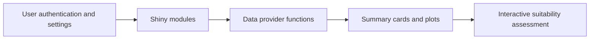

# R - Shiny Dashboard for Irrigation Management (Shiny, CSS, JavaScript)

## Overview

This project contains the R Shiny code for the Sesame Suitability Assessment Tool (SSAT), an interactive decision-support application for assessing land and climate suitability for sesame production across Australia.

## Demo Context

The folder is a portfolio snapshot of the application code and bundled assets that can be shared publicly. It illustrates modular Shiny application design, reusable server-side helpers, static assets, and app-level organisation for an agricultural decision-support tool.

## Tools Used

- R and Shiny for the interactive application layer
- Modular Shiny architecture across UI, server, and helper modules
- CSS and JavaScript assets under `WWW/` for custom styling and client-side behaviour
- Static geographic and location assets to support map-based and site-based interactions

## What The Project Does



- Provides a modular Shiny application with separate UI and server building blocks
- Supports paddock, comparison, plotting, and summary workflows
- Bundles static assets such as maps, logos, CSS, JavaScript, and supporting data

## Scale

- Related irrigation decision-support work represented by this portfolio includes:
  Phase I (the Burdekin region): +171K scenarios and +61M simulated seasonal records.
- Related irrigation decision-support work represented by this portfolio includes:
  Phase II (the Mackay-Whitsunday region): +148K scenarios and +50M simulated seasonal records.
- V1 includes 864 scenarios
- 3.75M simulated seasonal records
- +161M simulated daily records

## Repository Structure

```text
app.R
ui.R
server.R
fct_data_provider.R
fct_user.R
fct_utils.R
mod_*.R
WWW/
  AusMap.RData
  Locations.csv
  app_auth/
  comparison_settings/
  footer/
  header/
  paddock/
  plots/
  summary_card/
README.md
```

## Data Assets

- `WWW/AusMap.RData` and `WWW/Locations.csv` support geographic context and location-driven interactions.
- The `WWW/` folder contains the front-end assets used by the Shiny application.
- The repository focuses on the shareable application layer rather than the full underlying simulation datastore.

## Notes

- The codebase is structured as a modular Shiny app rather than a single-script prototype.
- This folder is well suited for reviewing application composition, modularity, and domain-focused UI organisation.
