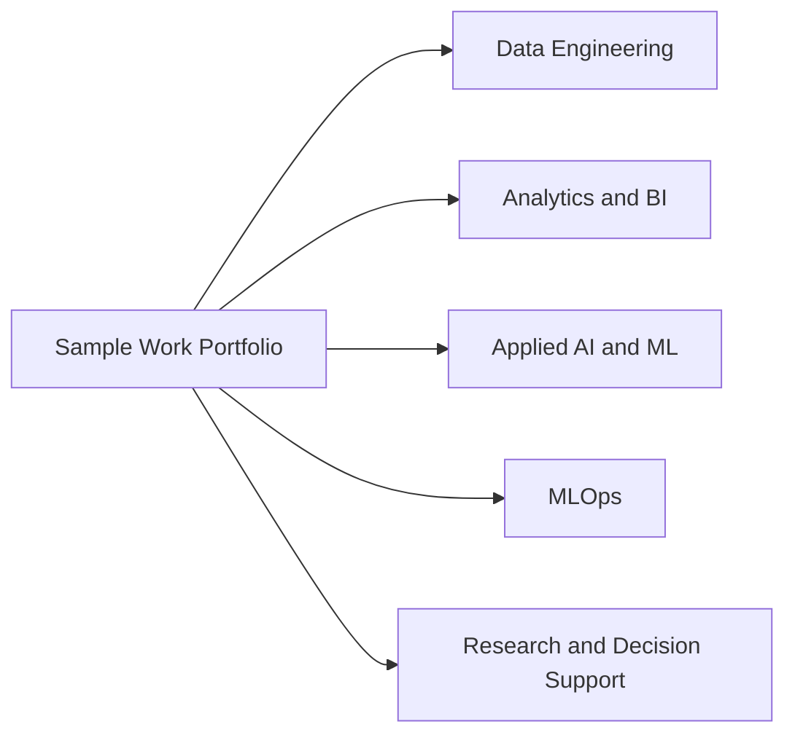

# Sample Work Portfolio

This repository is a curated portfolio of demo projects that I use to illustrate my work across data engineering, analytics, applied machine learning, MLOps, decision-support systems, and research computing.

Many of my production projects and consulting engagements cannot be shared publicly because the code, data, architecture, and delivery materials are proprietary. For that reason, the projects collected here rely on publicly shareable assets, synthetic data, dummy data, trimmed research artefacts, or representative implementation patterns. They are intended to demonstrate technical range and problem-solving approach rather than serve as full replicas of the real-world systems I have delivered.

## Portfolio Scope

## Projects

| Project | Focus Area | Key Tools | Summary |
| --- | --- | --- | --- |
| [Databricks - Automated Insurance Claims (Lakeflow, RDB, Declarative Pipeline, Stream)](./Databricks%20-%20Automated%20Insurance%20Claims%20(Lakeflow,%20RDB,%20Declarative%20Pipeline,%20Stream)) | Databricks, Lakeflow / DLT, Streaming Demo Architecture | Databricks, PySpark, Spark SQL, Auto Loader, Unity Catalog, Lakeflow Declarative Pipelines | Insurance-claims demo that combines telematics, CSV source feeds, claim images, and Bronze-to-Gold transformations with both DLT and non-DLT bronze ingestion options for demo and operational tradeoff illustration. |
| [Databricks - Lakehouse Data Engineering Pipeline (e-Commerce)](./Databricks%20-%20Lakehouse%20Data%20Engineering%20Pipeline%20(e-Commerce)) | Databricks, Delta Lake, Medallion Architecture | Databricks, PySpark, Spark SQL, Delta Lake, Unity Catalog | End-to-end e-commerce lakehouse pipeline that ingests CSV data, curates Bronze, Silver, and Gold tables, and prepares analytics-ready outputs. |
| [Databricks - Lakehouse Data Engineering Pipeline (Retail, Two Companies)](./Databricks%20-%20Lakehouse%20Data%20Engineering%20Pipeline%20(Retail,%20Two%20Companies)) | Databricks, Integration, Incremental Fact Processing | Databricks, PySpark, Spark SQL, Delta Lake, Databricks SQL | Multi-entity retail integration pipeline that conforms child-company data to a parent reporting model and produces a dashboard-ready serving layer. |
| [Snowflake - Sales Data ETL (Python and SQL Pipelines, S3 Integration, Pipe, Task, Stream)](./Snowflake%20-%20Sales%20Data%20ETL%20(Python%20and%20SQL%20Pipelines,%20S3%20Integration,%20Pipe,%20Task,%20Stream)) | Snowflake, Medallion Architecture, Incremental Loading | Snowflake, Snowpark Python, SQL, Amazon S3, Snowpipe | Twin SQL and Snowpark medallion pipelines that load Snowflake sample data, automate external S3 ingestion, and process Bronze-to-Silver increments with streams and tasks. |
| [Azure - Retail Analytics Pipeline (ADF, Event Hubs, Synapse, Stream)](./Azure%20-%20Retail%20Analytics%20Pipeline%20(ADF,%20Event%20Hubs,%20Synapse,%20Stream)) | Azure Data Engineering, Batch and Streaming Analytics | Azure Data Factory, ADLS Gen2, Synapse serverless SQL, Event Hubs, Stream Analytics, Python | Hybrid retail analytics demo that combines ADF batch ingestion, Synapse Bronze-Silver-Gold views, Event Hubs event simulation, and Stream Analytics tumbling-window funnel outputs. |
| [GenAI - Research Assistant (OpenAI, Langchain, Streamlit, FAISS)](./GenAI%20-%20Research%20Assistant%20(OpenAI,%20Langchain,%20Streamlit,%20FAISS)) | GenAI, RAG, Streamlit | Python, OpenAI, LangChain, Streamlit, FAISS | Streamlit research assistant that ingests article URLs, builds a FAISS vector store, and answers questions over extracted content. |
| [MLOps - Azure MLOps Pipeline (with CI-CD and Model Registry)](./MLOps%20-%20Azure%20MLOps%20Pipeline%20(with%20CI-CD%20and%20Model%20Registry)) | Azure ML, CI/CD, Model Governance | Azure ML, MLflow, GitHub Actions, Python, Spark | Parameterised Azure ML workflow for model training, evaluation, registration, deployment, and promotion through CI/CD. |
| [Research Publication Visualisations](./Research%20Publication%20Visualisations) | Research Communication | Markdown, publication graphics, scientific visualisation | Gallery of selected figures from peer-reviewed publications and posters. |
| [PowerBI - E-Commerce Sales Dashboard](./PowerBI%20-%20E-Commerce%20Sales%20Dashboard) | Power BI, Data Modelling | Power BI, R, data.table, star schema modelling | Power BI dashboard built on a synthetic e-commerce star schema with dimension and fact tables generated in R. |
| [Python - APSIM CoPilot (RAG, Azure, OpenAI, Docker, Container App)](./Python%20-%20APSIM%20CoPilot%20(RAG,%20Azure,%20OpenAI,%20Docker,%20Container%20App)) | RAG Application, Azure Deployment, Applied GenAI | Python, Streamlit, OpenAI API, Azure AI Search, Azure Blob Storage, Azure Key Vault, Docker, Azure Container Apps | End-to-end APSIM-focused RAG demo that ingests APSIM documentation, answers grounded questions, explains uploaded `.apsimx` files with a lightweight parser, summarises APSIM CSV outputs with minimal heuristics, and demonstrates Azure-hosted deployment. |
| [Python – Revenue Intelligence & Pipeline Analytics (CRM Data, Forecasting, Time-Series, Power BI)](./Python%20%E2%80%93%20Revenue%20Intelligence%20%26%20Pipeline%20Analytics%20(CRM%20Data,%20Forecasting,%20Time-Series,%20Power%20BI)) | Revenue Intelligence, Pipeline Analytics, BI Handoff | Python, pandas, DuckDB, scikit-learn, matplotlib, Jupyter, Power BI | CRM revenue-intelligence workflow that builds Bronze/Silver/Gold data products, derives forecasting and win-probability outputs, and prepares validated inputs for an in-progress Power BI dashboard. |
| [Python - Procurement Risk, Assurance, and Governance Reporting](./Python%20-%20Procurement%20Risk,%20Assurance,%20and%20Governance%20Reporting) | Governance Reporting, Procurement Analytics | Python, pandas, matplotlib, pytest, YAML config, Medallion architecture | End-to-end procurement governance reporting project that ingests public contract disclosure files, standardises schema-drifted sources, builds Bronze/Silver/Gold outputs, and publishes risk metrics, assurance checks, supplier segmentation, and executive reporting artefacts. |
| [Python - Customer Churn Analysis (EDA, Feature Engineering, ML)](./Python%20-%20Customer%20Churn%20Analysis%20(EDA,%20Feature%20Engineering,%20ML)) | Customer Analytics, Churn Modelling | Python, pandas, scikit-learn, Jupyter, seaborn | Notebook-first churn-analysis workflow covering data cleaning, EDA, customer segmentation, model comparison, and reporting. |
| [Python - Remote Sensing and Image Processing (Google Earth Engine, Landsat, Sentinel-2)](./Python%20-%20Remote%20Sensing%20and%20Image%20Processing%20(Google%20Earth%20Engine,%20Landsat,%20Sentinel-2)) | Remote Sensing, Image Processing | Python, Google Earth Engine, Landsat, Sentinel-2, vegetation indices | Crop-monitoring extraction scripts used to derive vegetation indices from satellite imagery for multiple crops in Vietnam. |
| [R - Irrigation Forecast Modelling (APSIM, Weather Forecasting, ggplot2)](./R%20-%20Irrigation%20Forecast%20Modelling%20(APSIM,%20Weather%20Forecasting,%20ggplot2)) | Crop Modelling, Forecast Evaluation | R, APSIM, SILO data workflows, ggplot2 | Research workflow for evaluating how weather forecast reliability affects irrigation decisions and production outcomes at scale. |
| [R - Shiny Dashboard for Irrigation Management (Shiny, CSS, JavaScript)](./R%20-%20Shiny%20Dashboard%20for%20Irrigation%20Management%20(Shiny,%20CSS,%20JavaScript)) | Shiny, Decision Support | R, Shiny, CSS, JavaScript, modular dashboard design | R Shiny application for interactive decision support built on large simulation datasets. |
| [R - Student Data Analysis](./R%20-%20Student%20Data%20Analysis) | Student Analytics, Exploratory Analysis | R, readxl, dplyr, ggplot2, rmarkdown, renv | Compact R analysis project that explores de-identified student data, profiles study-area patterns across subgroups, reviews missingness and correlations, and builds a simple retention analysis notebook with exported tables and figures. |
| [R - Time Series Analysis and Visualisation (Climate Extremes, ggplot2, SILO)](./R%20-%20Time%20Series%20Analysis%20and%20Visualisation%20(Climate%20Extremes,%20ggplot2,%20SILO)) | Climate Analytics, Time Series | R, time-series analysis, ggplot2, SILO, spatial trend analysis | Research analysis workflow studying long-term compound hot-dry weather extremes across Australia. |

## Repository Structure

Each project folder is self-contained and includes:

- `README.md` describing the project, structure, workflow, and available data or artefacts
- `LICENSE` containing the repository's proprietary usage notice
- `.gitignore` tuned to the tooling used in that project

## Data and Reuse Notes

- Some projects include dummy or synthetic data so the workflow can be inspected end to end.
- Some research projects include analysis scripts and output figures, but not the full original raw data pipeline.
- Where a repository snapshot only contains part of a larger real-world project, the corresponding project README states exactly what is present in this copy.
- Unless stated otherwise, the materials in this repository are provided as portfolio samples and not as reusable open-source project templates.
