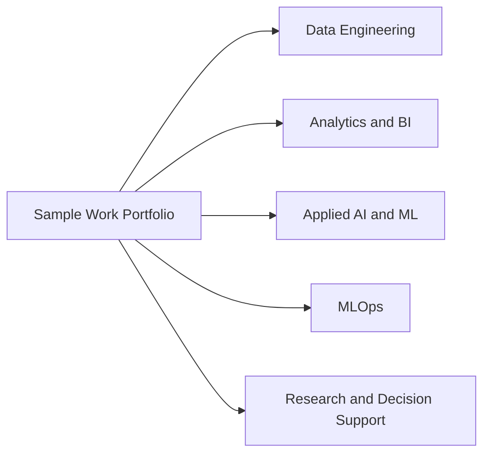

# Sample Work Portfolio

This repository is a curated portfolio of demo projects that I use to illustrate my work across data engineering, analytics, applied machine learning, MLOps, decision-support systems, and research computing.

Many of my production projects and consulting engagements cannot be shared publicly because the code, data, architecture, and delivery materials are proprietary. For that reason, the projects collected here rely on publicly shareable assets, synthetic data, dummy data, trimmed research artefacts, or representative implementation patterns. They are intended to demonstrate technical range and problem-solving approach rather than serve as full replicas of the real-world systems I have delivered.

## Portfolio Scope

## Projects

| Project | Focus Area | Summary |
| --- | --- | --- |
| [Databricks - Lakehouse Data Engineering Pipeline (e-Commerce)](./Databricks%20-%20Lakehouse%20Data%20Engineering%20Pipeline%20(e-Commerce)) | Databricks, Delta Lake, Medallion Architecture | End-to-end e-commerce lakehouse pipeline that ingests CSV data, curates Bronze, Silver, and Gold tables, and prepares analytics-ready outputs. |
| [Databricks - Lakehouse Data Engineering Pipeline (Retail, Two Companies)](./Databricks%20-%20Lakehouse%20Data%20Engineering%20Pipeline%20(Retail,%20Two%20Companies)) | Databricks, Integration, Incremental Fact Processing | Multi-entity retail integration pipeline that conforms child-company data to a parent reporting model and produces a dashboard-ready serving layer. |
| [GenAI - Research Assistant (OpenAI, Langchain, Streamlit, FAISS)](./GenAI%20-%20Research%20Assistant%20(OpenAI,%20Langchain,%20Streamlit,%20FAISS)) | GenAI, RAG, Streamlit | Streamlit research assistant that ingests article URLs, builds a FAISS vector store, and answers questions over extracted content. |
| [MLOps - Azure MLOps Pipeline (with CI-CD and Model Registry)](./MLOps%20-%20Azure%20MLOps%20Pipeline%20(with%20CI-CD%20and%20Model%20Registry)) | Azure ML, CI/CD, Model Governance | Parameterised Azure ML workflow for model training, evaluation, registration, deployment, and promotion through CI/CD. |
| [Research Publication Visualisations](./Research%20Publication%20Visualisations) | Research Communication | Gallery of selected figures from peer-reviewed publications and posters. |
| [PowerBI - E-Commerce Sales Dashboard](./PowerBI%20-%20E-Commerce%20Sales%20Dashboard) | Power BI, Data Modelling | Power BI dashboard built on a synthetic e-commerce star schema with dimension and fact tables generated in R. |
| [UniSQ - Crop Monitoring Vietnam](./UniSQ%20-%20Crop%20Monitoring%20Vietnam) | Remote Sensing, Google Earth Engine | Crop-monitoring extraction scripts used to derive vegetation indices from satellite imagery for multiple crops in Vietnam. |
| [UniSQ - Short-Term Forecast for Irrigation Management](./UniSQ%20-%20Short-Term%20Forecast%20for%20Irrigation%20Management) | APSIM, R, Environmental Modelling | Research workflow for evaluating how weather forecast reliability affects irrigation decisions and production outcomes at scale. |
| [UniSQ - SSAT](./UniSQ%20-%20SSAT) | Shiny, Decision Support | R Shiny application for sesame suitability assessment across Australian environments using large simulation datasets. |
| [UQ - Compound Dry-Hot Extremes](./UQ%20-%20Compound%20Dry-Hot%20Extremes) | Climate Analytics, R | Research analysis workflow studying long-term compound hot-dry weather extremes across Australia. |

## Selected Scale Snapshots

- Related real-world decision-support work represented in this portfolio includes: Phase I (the Burdekin region): +171K scenarios and +61M simulated seasonal records.
- Related real-world decision-support work represented in this portfolio includes: Phase II (the Mackay-Whitsunday region): +148K scenarios and +50M simulated seasonal records.
- `UniSQ - SSAT`: V1 includes 864 scenarios, 3.75M simulated seasonal records, and +161M simulated daily records.
- `UniSQ - Short-Term Forecast for Irrigation Management`: 864 scenarios, 17M simulated seasonal records, and +677M simulated daily records.

## Repository Structure

Each project folder is self-contained and includes:

- `README.md` describing the project, structure, workflow, and available data or artefacts
- `LICENSE` containing the repository's proprietary usage notice
- `.gitignore` tuned to the tooling used in that project

## Data and Reuse Notes

- Some projects include dummy or synthetic data so the workflow can be inspected end to end.
- Some research projects include analysis scripts and output figures, but not the full original raw data pipeline.
- Where a repository snapshot only contains part of a larger real-world project, the corresponding project README states exactly what is present in this copy.
- Unless stated otherwise, the materials in this repository are provided as portfolio samples and not as reusable open-source project templates.
