# Snowflake SQL + Python Twin Medallion Project

This project builds the same Snowflake pipeline in two modes:

- `sql_*`: run the SQL files directly and create Snowflake objects tagged with `sql_`.
- `py_*`: run real Snowpark-based Python code and create the same object family tagged with `py_`.

The SQL and Python paths are twins in behavior, not in implementation style:

- the `sql_*` path is worksheet-friendly Snowflake SQL
- the `py_*` path is Python built on Snowpark, with SQL used only where Snowflake features such as tasks, streams, pipes, and storage integrations still need DDL statements

The project now follows a true Medallion layout:

- Bronze: landing and raw ingestion
- Silver: cleaned and business-ready tables
- Gold: analytics-ready aggregates and views

## What the project covers

- Core connection and environment management
- Warehouse plus medallion schema provisioning
- Bronze ingestion from `SNOWFLAKE_SAMPLE_DATA.TPCH_SF1`
- Bronze to Silver promotion with curated transformations
- Gold analytics tables and views
- External S3 stage + Snowpipe auto-ingest into Bronze
- Streams and tasks for Bronze to Silver incremental processing
- Mock event generation for ongoing file drops

## Setup

1. Copy `.env.example` to `.env`.
2. Fill in your Snowflake credentials and project settings.
3. Create or update the environment with `make setup` or `make setup-update`.

## Recommended execution order

Run the Python pipeline:

```bash
python python/py_01_bootstrap.py
python python/py_02_core_ingestion.py
python python/py_03_transformations.py
python python/py_04_create_storage_integration.py
python python/py_05_storage_integration_check.py
python python/py_06_snowpipe_external.py
python python/py_07_validate_snowpipe_objects.py
```

Run the SQL pipeline by opening each matching `sql/sql_*.sql` file, updating the config values at the top, and executing it in order.

If you are running the SQL path manually, start with
`sql/sql_00_session_init.sql` once in the same worksheet or SnowSQL session.
The later SQL step files now assume that shared session context already exists.

Important:

- `sql_04_create_storage_integration.sql` requires a role that can create storage integrations, typically `ACCOUNTADMIN` or a custom role with `CREATE INTEGRATION`.
- the Python path is implemented with Snowpark rather than by replaying the SQL files
- the earlier internal-stage demo path was removed so the project now focuses on the full Snowpipe pipeline

## Medallion layout

Given `PROJECT_DATABASE=<PROJECT_DATABASE>`, the project creates:

- `<PROJECT_DATABASE>.BRONZE`
- `<PROJECT_DATABASE>.SILVER`
- `<PROJECT_DATABASE>.GOLD`

### Bronze objects

- `sql_customer_bronze` / `py_customer_bronze`
- `sql_orders_bronze` / `py_orders_bronze`
- `sql_lineitem_bronze` / `py_lineitem_bronze`
- `sql_snowpipe_orders_bronze` / `py_snowpipe_orders_bronze`
- Snowpipe landing stages

### Silver objects

- `sql_customer_silver` / `py_customer_silver`
- `sql_orders_silver` / `py_orders_silver`
- `sql_lineitem_silver` / `py_lineitem_silver`
- `sql_mock_orders_silver` / `py_mock_orders_silver`
- Bronze-to-Silver streams and tasks

### Gold objects

- `sql_order_daily_gold` / `py_order_daily_gold`
- `sql_high_value_customers_gold_v` / `py_high_value_customers_gold_v`
- `sql_medallion_summary_gold_v` / `py_medallion_summary_gold_v`

## Step responsibilities

- `sql_00`: optional one-time SQL session setup for manual runs
- `sql_01` / `py_01`: create warehouse, Bronze/Silver/Gold schemas, file formats, stages, and base tables
- `sql_02` / `py_02`: ingest TPCH sample data into Bronze
- `sql_03` / `py_03`: promote Bronze to Silver and build Gold analytics
- `sql_04` / `py_04`: create or update the Snowflake storage integration
- `sql_05` / `py_05`: inspect `DESC INTEGRATION` output for AWS trust setup
- `sql_06` / `py_06`: create external S3 Bronze stage, Snowpipe, Bronze streams, and Silver merge tasks
- `sql_07` / `py_07`: validate that the Snowpipe-related Snowflake objects exist

## Pipeline diagram

```mermaid
flowchart TD
    A["SQL 00 / shared session init<br/>Set role, warehouse, variables"] --> B["SQL 01 / PY 01<br/>Create warehouse<br/>Create <PROJECT_DATABASE>.BRONZE / SILVER / GOLD<br/>Create Bronze, Silver, Gold base objects"]
    B --> C["SQL 02 / PY 02<br/>Load TPCH sample data into Bronze<br/>customer_bronze, orders_bronze, lineitem_bronze"]
    C --> D["SQL 03 / PY 03<br/>Promote Bronze to Silver<br/>Build Gold table and views"]
    D --> E["SQL 04 / PY 04<br/>Create STORAGE INTEGRATION<br/>Link Snowflake to AWS IAM role"]
    E --> F["SQL 05 / PY 05<br/>DESC INTEGRATION<br/>Capture STORAGE_AWS_IAM_USER_ARN and STORAGE_AWS_EXTERNAL_ID"]
    F --> G["AWS manual setup<br/>Update IAM trust<br/>Update SNS topic policy<br/>Configure S3 event notification"]
    G --> H["SQL 06 / PY 06<br/>Create external S3 stage<br/>Create PIPE<br/>Create Bronze STREAM<br/>Create Silver TASK<br/>Resume TASK"]
    H --> I["scripts/push_mock_batch_to_s3.py<br/>Generate and upload .csv.gz file to sql/ or py/"]
    I --> J["Snowpipe loads file into BRONZE<br/>sql_snowpipe_orders_bronze / py_snowpipe_orders_bronze"]
    J --> K["STREAM captures new Bronze rows"]
    K --> L["TASK merges rows into SILVER<br/>sql_mock_orders_silver / py_mock_orders_silver<br/>load_method = SNOWPIPE"]
    L --> M["SQL 07 / PY 07 validation<br/>LIST stage<br/>SHOW pipe / stage / stream / task<br/>SYSTEM$PIPE_STATUS<br/>COPY_HISTORY<br/>Silver row checks"]
```



The diagram shows the shared project flow. The twin pipelines create the same object families, but:

- the `sql_*` path uses Snowflake SQL files directly
- the `py_*` path uses Snowpark for data movement and SQL for DDL-heavy Snowflake features

## Paired step map

- `sql/sql_00_session_init.sql`: optional one-time SQL session setup for manual runs
- `sql/sql_01_bootstrap.sql` <-> `python/py_01_bootstrap.py`
- `sql/sql_02_core_ingestion.sql` <-> `python/py_02_core_ingestion.py`
- `sql/sql_03_transformations.sql` <-> `python/py_03_transformations.py`
- `sql/sql_04_create_storage_integration.sql` <-> `python/py_04_create_storage_integration.py`
- `sql/sql_05_storage_integration_check.sql` <-> `python/py_05_storage_integration_check.py`
- `sql/sql_06_snowpipe_external.sql` <-> `python/py_06_snowpipe_external.py`
- `sql/sql_07_validate_snowpipe_objects.sql` <-> `python/py_07_validate_snowpipe_objects.py`

## Python implementation notes

- The `py_*` path uses Snowpark sessions created from the project `.env`.
- Table ingestion and medallion transformations are implemented as Snowpark DataFrame operations.
- Snowflake features that are still naturally DDL-driven, such as streams, tasks, stages, pipes, and storage integrations, are executed from Python through `session.sql(...)`.

## AWS setup for Snowpipe auto-ingest

`sql_04` / `py_04` create the Snowflake storage integration, `sql_05` / `py_05` let you capture the AWS trust values, and `sql_06` / `py_06` create the remaining Snowpipe objects after AWS trust is ready.

Use the dedicated cloud setup guide for the full procedure:

- `docs/AWS_SNOWPIPE_SETUP.md`

In summary, the AWS/Snowpipe workflow is:

1. Create the S3 bucket and the `sql/` and `py/` prefixes.
2. Create the IAM role and S3 read policy for Snowflake.
3. Create the SNS topic and S3 event notification.
4. Run `sql_04` / `py_04` to create the storage integration.
5. Run `sql_05` / `py_05` to capture the Snowflake IAM user ARN and external ID.
6. Update the AWS IAM trust relationship and SNS topic policy with those values.
7. Run `sql_06` / `py_06` to create the stage, pipe, stream, and task.
8. Upload a file with `scripts/push_mock_batch_to_s3.py`.
9. Validate the flow with `sql_07` or `py_07`.

Use the helper scripts when needed:

- `scripts/setup_aws_profile.bat`
- `scripts/setup_aws_profile.sh`
- `scripts/push_mock_batch_to_s3_sql.bat` (which calls `scripts/push_mock_batch_to_s3.py` with the `sql` prefix)
- `scripts/push_mock_batch_to_s3_py.bat` (which calls `scripts/push_mock_batch_to_s3.py` with the `py` prefix)

## Example verification queries

Inspect medallion row counts:

```sql
SELECT * FROM <PROJECT_DATABASE>.GOLD.sql_medallion_summary_gold_v;
SELECT * FROM <PROJECT_DATABASE>.GOLD.py_medallion_summary_gold_v;
```

Inspect the Silver incremental target:

```sql
SELECT * FROM <PROJECT_DATABASE>.SILVER.py_mock_orders_silver
ORDER BY ingested_at DESC;
```

## References

- Snowflake storage integrations: https://docs.snowflake.com/en/sql-reference/sql/create-storage-integration
- Snowflake S3 storage integration guide: https://docs.snowflake.com/user-guide/data-load-s3-config-storage-integration
- Snowflake pipes: https://docs.snowflake.com/en/sql-reference/sql/create-pipe
- Snowflake tasks overview: https://docs.snowflake.com/en/user-guide/tasks-intro.html
- AWS S3 event notifications: https://docs.aws.amazon.com/AmazonS3/latest/userguide/enable-event-notifications.html
