# Snowflake SQL + Python Twin Medallion Project

This project builds the same Snowflake pipeline in two modes:

- `sql_*`: run the SQL files directly and create Snowflake objects tagged with `sql_`.
- `py_*`: run real Snowpark-based Python code and create the same object family tagged with `py_`.

The SQL and Python paths are twins in behavior, not in implementation style:

- the `sql_*` path is worksheet-friendly Snowflake SQL
- the `py_*` path is Python built on Snowpark, with SQL used only where Snowflake features such as tasks, streams, pipes, and storage integrations still need DDL statements

The project now follows a true Medallion layout:

- Bronze: landing and raw ingestion
- Silver: cleaned and business-ready tables
- Gold: analytics-ready aggregates and views

## What the project covers

- Core connection and environment management
- Warehouse plus medallion schema provisioning
- Bronze ingestion from `SNOWFLAKE_SAMPLE_DATA.TPCH_SF1`
- Bronze to Silver promotion with curated transformations
- Gold analytics tables and views
- External S3 stage + Snowpipe auto-ingest into Bronze
- Streams and tasks for Bronze to Silver incremental processing
- Mock event generation for ongoing file drops

## Setup

1. Copy `.env.example` to `.env`.
2. Fill in your Snowflake credentials and project settings.
3. Create or update the environment with `make setup` or `make setup-update`.

## Recommended execution order

Run the Python twin path:

```bash
python python/py_01_bootstrap.py
python python/py_02_core_ingestion.py
python python/py_03_transformations.py
python python/py_04_create_storage_integration.py
python python/py_05_storage_integration_check.py
python python/py_06_snowpipe_external.py
```

Run the SQL twin path by opening each matching `sql/sql_*.sql` file, updating the config values at the top, and executing it in order.

If you are running the SQL path manually, start with
`sql/sql_00_session_init.sql` once in the same worksheet or SnowSQL session.
The later SQL step files now assume that shared session context already exists.

Important:

- `sql_04_create_storage_integration.sql` requires a role that can create storage integrations, typically `ACCOUNTADMIN` or a custom role with `CREATE INTEGRATION`.
- the Python path is implemented with Snowpark rather than by replaying the SQL files
- the earlier internal-stage demo path was removed so the project now focuses on the full Snowpipe pipeline

## Medallion layout

Given `PROJECT_DATABASE=TRAINING_0001`, the project creates:

- `TRAINING_0001.BRONZE`
- `TRAINING_0001.SILVER`
- `TRAINING_0001.GOLD`

### Bronze objects

- `sql_customer_bronze` / `py_customer_bronze`
- `sql_orders_bronze` / `py_orders_bronze`
- `sql_lineitem_bronze` / `py_lineitem_bronze`
- `sql_snowpipe_orders_bronze` / `py_snowpipe_orders_bronze`
- Snowpipe landing stages

### Silver objects

- `sql_customer_silver` / `py_customer_silver`
- `sql_orders_silver` / `py_orders_silver`
- `sql_lineitem_silver` / `py_lineitem_silver`
- `sql_mock_orders_silver` / `py_mock_orders_silver`
- Bronze-to-Silver streams and tasks

### Gold objects

- `sql_order_daily_gold` / `py_order_daily_gold`
- `sql_high_value_customers_gold_v` / `py_high_value_customers_gold_v`
- `sql_medallion_summary_gold_v` / `py_medallion_summary_gold_v`

## Step responsibilities

- `sql_00`: optional one-time SQL session setup for manual runs
- `sql_01` / `py_01`: create warehouse, Bronze/Silver/Gold schemas, file formats, stages, and base tables
- `sql_02` / `py_02`: ingest TPCH sample data into Bronze
- `sql_03` / `py_03`: promote Bronze to Silver and build Gold analytics
- `sql_04` / `py_04`: create or update the Snowflake storage integration
- `sql_05` / `py_05`: inspect `DESC INTEGRATION` output for AWS trust setup
- `sql_06` / `py_06`: create external S3 Bronze stage, Snowpipe, Bronze streams, and Silver merge tasks
- `sql_07`: validate that the Snowpipe-related Snowflake objects exist

## Pipeline diagram

```mermaid
flowchart TD
    A["SQL 00 / shared session init<br/>Set role, warehouse, variables"] --> B["SQL 01 / PY 01<br/>Create warehouse<br/>Create TRAINING_0001.BRONZE / SILVER / GOLD<br/>Create Bronze, Silver, Gold base objects"]
    B --> C["SQL 02 / PY 02<br/>Load TPCH sample data into Bronze<br/>customer_bronze, orders_bronze, lineitem_bronze"]
    C --> D["SQL 03 / PY 03<br/>Promote Bronze to Silver<br/>Build Gold table and views"]
    D --> E["SQL 04 / PY 04<br/>Create STORAGE INTEGRATION<br/>Link Snowflake to AWS IAM role"]
    E --> F["SQL 05 / PY 05<br/>DESC INTEGRATION<br/>Capture STORAGE_AWS_IAM_USER_ARN and STORAGE_AWS_EXTERNAL_ID"]
    F --> G["AWS manual setup<br/>Update IAM trust<br/>Update SNS topic policy<br/>Configure S3 event notification"]
    G --> H["SQL 06 / PY 06<br/>Create external S3 stage<br/>Create PIPE<br/>Create Bronze STREAM<br/>Create Silver TASK<br/>Resume TASK"]
    H --> I["scripts/push_mock_batch_to_s3.py<br/>Generate and upload .csv.gz file to sql/ or py/"]
    I --> J["Snowpipe loads file into BRONZE<br/>sql_snowpipe_orders_bronze / py_snowpipe_orders_bronze"]
    J --> K["STREAM captures new Bronze rows"]
    K --> L["TASK merges rows into SILVER<br/>sql_mock_orders_silver / py_mock_orders_silver<br/>load_method = SNOWPIPE"]
    L --> M["SQL 07 validation<br/>LIST stage<br/>SHOW pipe / stage / stream / task<br/>SYSTEM$PIPE_STATUS<br/>COPY_HISTORY<br/>Silver row checks"]
```



The diagram shows the shared project flow. The SQL and Python twins create the same object families, but:

- the `sql_*` path uses Snowflake SQL files directly
- the `py_*` path uses Snowpark for data movement and SQL for DDL-heavy Snowflake features

## Paired step map

- `sql/sql_00_session_init.sql`: optional one-time SQL session setup for manual runs
- `sql/sql_01_bootstrap.sql` <-> `python/py_01_bootstrap.py`
- `sql/sql_02_core_ingestion.sql` <-> `python/py_02_core_ingestion.py`
- `sql/sql_03_transformations.sql` <-> `python/py_03_transformations.py`
- `sql/sql_04_create_storage_integration.sql` <-> `python/py_04_create_storage_integration.py`
- `sql/sql_05_storage_integration_check.sql` <-> `python/py_05_storage_integration_check.py`
- `sql/sql_06_snowpipe_external.sql` <-> `python/py_06_snowpipe_external.py`
- `sql/sql_07_validate_snowpipe_objects.sql`: list pipes, stages, streams, and tasks after Snowpipe setup

## Python implementation notes

- The `py_*` path uses Snowpark sessions created from the project `.env`.
- Table ingestion and medallion transformations are implemented as Snowpark DataFrame operations.
- Snowflake features that are still naturally DDL-driven, such as streams, tasks, stages, pipes, and storage integrations, are executed from Python through `session.sql(...)`.

## AWS setup for Snowpipe auto-ingest

`sql_04` / `py_04` create the Snowflake storage integration, `sql_05` / `py_05` let you capture the AWS trust values, and `sql_06` / `py_06` create the remaining Snowpipe objects after AWS trust is ready.

For the full cloud-side walkthrough, use:

- `docs/AWS_SNOWPIPE_SETUP.md`

### 1. Create the S3 bucket and prefix

Create a bucket or reuse an existing one, then create a prefix for incoming files:

- Bucket: `bc-snowflake-training-0001`
- Python prefix: `py/`
- SQL prefix: `sql/`

Set this in `.env`:

```env
AWS_S3_BUCKET_URL=s3://bc-snowflake-training-0001
AWS_PROFILE=bc-snowflake-training-0001
```

Recommended local AWS setup for this project:

```bash
aws configure sso --profile bc-snowflake-training-0001
aws sso login --profile bc-snowflake-training-0001
```

Helper scripts are also included:

```bash
scripts/setup_aws_profile.bat sso
scripts/setup_aws_profile.sh sso
```

If `aws` is not installed yet, the Windows batch helper will offer to install
AWS CLI v2 with the official MSI installer. You can also install it manually:

```powershell
msiexec.exe /i https://awscli.amazonaws.com/AWSCLIV2.msi
```

After installation, reopen the terminal and confirm:

```powershell
aws --version
```

If you use access keys instead of SSO, you can also run:

```bash
aws configure --profile bc-snowflake-training-0001
```

The S3 uploader script will automatically use `AWS_PROFILE` from `.env` when it is set.

### 2. Create an SNS topic

Create a standard SNS topic, not FIFO.

Current topic:

- Name: `bc-snowflake-training-0001`
- ARN: `arn:aws:sns:ap-southeast-2:472506472624:bc-snowflake-training-0001`

### 3. Create the Snowflake storage integration first

Run:

```sql
sql/sql_04_create_storage_integration.sql
```

Then inspect the integration with:

You can do that inspection with the helper file:

```sql
sql/sql_05_storage_integration_check.sql
```

Or run the command directly:

```sql
DESC INTEGRATION resume_s3_int;
```

Current AWS naming in this project:

- IAM role name: `bc-snowflake-training-0001`
- IAM role ARN: `arn:aws:iam::472506472624:role/bc-snowflake-training-0001`
- IAM policy name: `bc-snowflake-training-0001`

Capture these values from the result:

- `STORAGE_AWS_IAM_USER_ARN`
- `STORAGE_AWS_EXTERNAL_ID`

You will need both values in the AWS trust policy.

### 4. Create an IAM policy for S3 access

Attach a policy that allows Snowflake to list the bucket and read objects under your prefix.

```json
{
  "Version": "2012-10-17",
  "Statement": [
    {
      "Sid": "AllowBucketList",
      "Effect": "Allow",
      "Action": ["s3:ListBucket"],
      "Resource": "arn:aws:s3:::bc-snowflake-training-0001",
      "Condition": {
        "StringLike": {
          "s3:prefix": ["sql/*", "py/*"]
        }
      }
    },
    {
      "Sid": "AllowObjectRead",
      "Effect": "Allow",
      "Action": ["s3:GetObject", "s3:GetObjectVersion"],
      "Resource": [
        "arn:aws:s3:::bc-snowflake-training-0001/sql/*",
        "arn:aws:s3:::bc-snowflake-training-0001/py/*"
      ]
    }
  ]
}
```

### 5. Create an IAM role trusted by Snowflake

Use the values from `DESC INTEGRATION` in the trust policy below:

```json
{
  "Version": "2012-10-17",
  "Statement": [
    {
      "Effect": "Allow",
      "Principal": {
        "AWS": "SNOWFLAKE_STORAGE_AWS_IAM_USER_ARN"
      },
      "Action": "sts:AssumeRole",
      "Condition": {
        "StringEquals": {
          "sts:ExternalId": "SNOWFLAKE_STORAGE_AWS_EXTERNAL_ID"
        }
      }
    }
  ]
}
```

The role ARN already used by the project defaults is:

```env
AWS_STORAGE_AWS_ROLE_ARN=arn:aws:iam::472506472624:role/bc-snowflake-training-0001
```

If you recreate the role under a different AWS account or name later, update `.env` and rerun `sql_04_create_storage_integration.sql`.

### 6. Allow S3 to publish to SNS

Add an SNS topic policy that allows `s3.amazonaws.com` to publish, restricted to your bucket ARN.

### 7. Configure the S3 bucket event notification

In S3 bucket properties, create an event notification:

- Event types: `All object create events`
- Prefix: leave blank for the whole bucket, or create separate notifications for `py/` and `sql/`
- Suffix: `.csv.gz`
- Destination: the SNS topic

### 8. Resume the Snowpipe and send files

After the AWS trust policy, SNS topic, and S3 notifications are configured, run:

```sql
sql/sql_06_snowpipe_external.sql
```

Or:

```bash
python python/py_06_snowpipe_external.py
```

After that, refresh the pipe if needed:

```sql
ALTER PIPE <db>.<bronze_schema>.sql_orders_pipe REFRESH;
ALTER PIPE <db>.<bronze_schema>.py_orders_pipe REFRESH;
```

You can then validate the created objects with:

```sql
sql/sql_07_validate_snowpipe_objects.sql
```

Then upload files into the SQL and Python prefixes. You can use `scripts/push_mock_batch_to_s3.py` to upload a gzip-compressed batch file from the local seed data.

## Example verification queries

Inspect medallion row counts:

```sql
SELECT * FROM TRAINING_0001.GOLD.sql_medallion_summary_gold_v;
SELECT * FROM TRAINING_0001.GOLD.py_medallion_summary_gold_v;
```

Inspect the Silver incremental target:

```sql
SELECT * FROM TRAINING_0001.SILVER.py_mock_orders_silver
ORDER BY ingested_at DESC;
```

## References

- Snowflake storage integrations: https://docs.snowflake.com/en/sql-reference/sql/create-storage-integration
- Snowflake S3 storage integration guide: https://docs.snowflake.com/user-guide/data-load-s3-config-storage-integration
- Snowflake pipes: https://docs.snowflake.com/en/sql-reference/sql/create-pipe
- Snowflake tasks overview: https://docs.snowflake.com/en/user-guide/tasks-intro.html
- AWS S3 event notifications: https://docs.aws.amazon.com/AmazonS3/latest/userguide/enable-event-notifications.html
